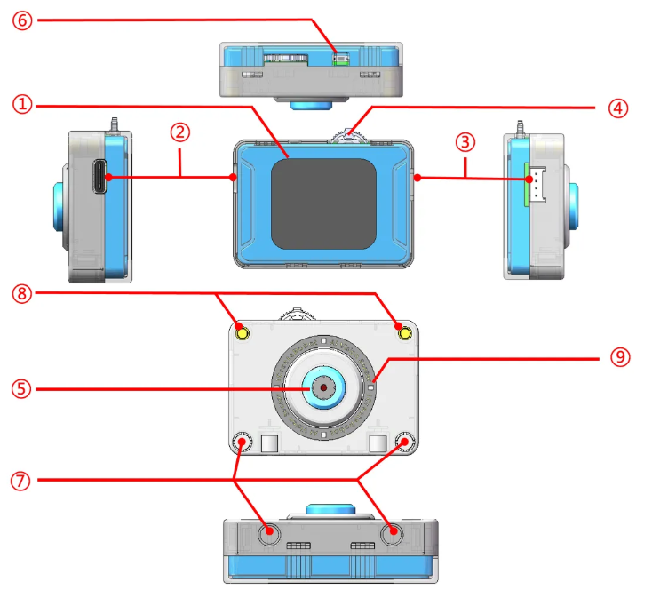

# Introduction

This module adopts the K210 as its AI processing core. Users can switch between multiple built-in AI functions by toggling the dial wheel on the top. On the right side, it is equipped with a Grove interface, which can be configured via a graphical interface to support communication protocols (I²C or UART). It allows connection to various peripherals and is compatible with LEGO SPIKE and EV3 systems, providing high compatibility and ease of use. In addition, the module communicates with the K210 through an ESP32-S3, enabling stable and efficient Wi-Fi image transmission.

## Structure  

| **No.** | **Component** | **Description** |
| :---: | :---: | :---: |
| ① | LCD Display | Displays the UI interface and camera view |
| ② | USB-C Port | For power supply and firmware updates |
| ③ | Grove Port | HY2.0-4P port for power supply and signal transmission |
| ④ | Dial Button | Left/right toggle and press operations for switching and activating functions |
| ⑤ | Camera | Captures images for K210 processing |
| ⑥ | Reset Button | Reboots the module |
| ⑦ | Building Block Ports | For connecting LEGO-compatible pins |
| ⑧ | M3 Mounting Holes | For assembly with M3 standard screws |
| ⑨ | Fill Light | Provides auxiliary lighting to adjust ambient brightness |

## Specifications  
| Item | Description   |
| :---: | :---: |
| Product Name | K210 AI Vision Sensor |
| Product Code   | B0210010 |
| Dimensions   | 56 × 40 × 21 mm |
| Weight   |  28 ± 1 g   |
| Control Chips |  Kendryte K210 + ESP32-S3   |
| Camera | 2-megapixel camera |
| Communication Interface | I²C / UART / SPIKE |
| I²C Rate   | 100 kbps |
| UART Baud Rate | 115200 |
| Operating Temperature | 0 – 50 ℃ |
| Power Supply |  5V / 1A   |

