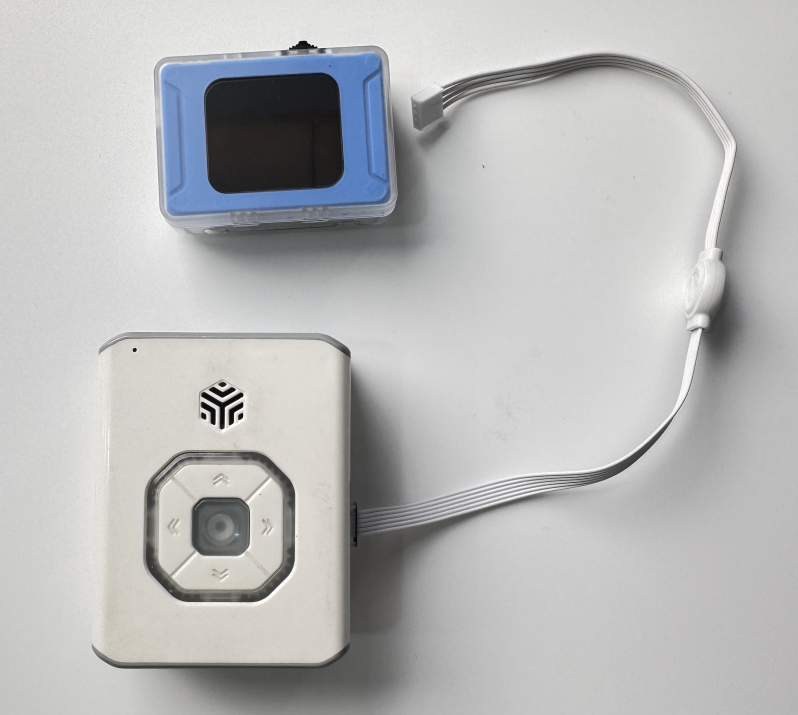

# Quick Start
## Power On
### Power Supply  
**Instructions:**

+ The vision module requires an external device for power supply.
+ The external device can be connected via USB or the Grove port, providing 5V–1A power to the module.

**Examples of Power Supply:**

|  |  |
| :---: | :---: |
| Computer USB power supply | ICBricks 2.0 main controller power supply |

### Power-On State
Instructions:

+ Once powered by an external device, the vision module will automatically turn on.
+ During startup, the display will show the text “ICreateRobot AI Vision” and the fill light will turn green.
+ After successful startup, the module will enter the “Color Recognition” function interface by default. The status bar and menu bar are hidden; press the dial button to bring them up.

## Basic Operation
+ After startup, the control interface defaults to the “Color Recognition” mode.
+ Push the dial left or right to switch between different functions.
+ In the settings interface, you can use press, left toggle, or right toggle operations on the dial to select settings.

