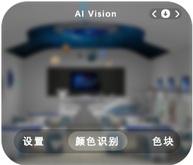
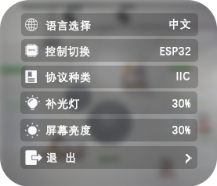

# Control Interface Description
Each AI function of the vision module corresponds to an independent interface (except the settings interface). Users can directly operate the module through the dial button, without relying on external port control.

+ Toggle the dial button left or right to switch between different function interfaces.
+ Once you enter a specific interface, the corresponding AI function will be automatically enabled.
+ If an AI function contains additional steps (such as “select” or “learn”), press the dial button for further control (specific operations depend on the current function; see the descriptions in the AI Functions section).

_Note: The images shown are for reference only. The actual display may vary depending on the module._

_****_

## **Top Status Bar & Bottom Navigation Bar**

To optimize display clarity, both the top and bottom bars automatically hide after 5s of inactivity.

+ **Redisplay status bar:**  
Perform any dial button action (click or toggle).
    - This action only restores the display and does not trigger any function change or setting modification.
+ **Resume operations:**  
After the bars reappear, you can continue using the dial button for normal function control.

Design purpose: keep the interface clean and avoid accidental interference with ongoing tasks.

**Layout Description:**

1. **Bottom Navigation Bar**
    - **Center highlighted icon:** currently active function
    - **Left/Right icons:** represent the “previous” and “next” functions (switchable via left/right dial toggle)
2. **Top Status Bar**
    - Displays information dynamically based on the active function
    - Specific details vary depending on function requirements

> Interaction Logic: When the dial is toggled left or right, the highlighted marker in the bottom bar updates in real time, and the top bar synchronously refreshes with information for the target function.
>

## Settings Interface

The settings interface is used to configure basic module parameters such as language, port protocol, brightness, and fill light.

+ When entering this interface for the first time, press the dial button to activate the settings.
+ By default, the language option is selected (highlighted).
+ Toggle the dial left/right to switch to other options (e.g., port protocol).
+ After making changes, select Exit to save and exit.

_Note: Some settings require a restart to take effect; the module will reboot automatically._

| Settings Options | Descriptions |
| :---: | --- |
| Language | Switch between Chinese / English by pressing the button. |
| Control Chip | When selecting the **port protocol option** in the setting interface, **click** the button to switch between** K210** or **ESP32** mode. + **K210 Mode:  **     - Ports communicate directly with the K210 chip using the selected protocol. + **ESP32 Mode**     - The K210 and ESP32 communicate via a fixed I²C protocol.     - In this mode, programming can be used to control the onboard ESP32, which in turn indirectly operates the K210.     - External ports are connected to the ESP32, allowing developers to perform secondary development on the K210 through the ESP32. |
| Port Protocol | The protocol used to communicate with the K210 depends on the Control Chip setting. Refer to the Communication Protocol section for detailed specifications. The protocol can be selected by pressing the dial button. + **K210 Mode:**     - I²C / UART / SPIKE-compatible mode + **ESP32 Mode:  **     - I²C  When set to SPIKE mode, the module must connect to a SPIKE device via an adapter board; otherwise, it will not function properly. See the **SPIKE compatibility document** for details. |
| Address Selection | Select the I²C address for K210: options are 0x24 / 0x25 / 0x26. |
| Fill Light | Fill Light Settings **Fill Light Status:** Two modes are available — On and Off. The fill light will only illuminate when set to On; otherwise, it remains off. **Fill Light Brightness:** Adjustable from 0% to 100% in 10% increments. More precise adjustments are not supported. **Return:** Exit the fill light settings mode. |
| Screen Brightness | Adjusts the display brightness within the range of 20%–100%, in 20% increments. Finer adjustments are not supported. |
| Exit | Exits the settings menu and saves changes. You must click Exit after making modifications to ensure settings are saved. 1. Saving Rules:     - General Settings (e.g., language): Saved directly, no reboot required. 2. Key Parameters (Control Chip / Port Protocol / Address Selection):     - If modified from the initial values upon entering the settings menu     - The module will automatically reboot after clicking Exit to apply the new configuration. > Note: If power is disconnected without actively clicking Exit, all modified settings will be lost!  |

