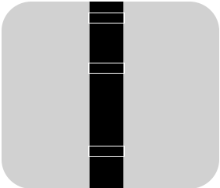

#Line Recognition

+ Used to detect black lines placed on a white background.
+ The screen will analyze the image and identify line contours within the upper, middle, and lower regions of the frame.
+ Recommended environment: Ensure no other interfering objects are present in the scene.

