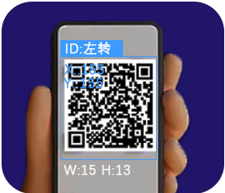

# QR Code Recognition

+ Supports recognition of standard square QR codes composed of black and white blocks.
+ Only one QR code can be recognized at a time.
+ When the camera is aligned with a QR code, the screen will highlight it with a bounding box and display:

       The decoded content.

       The QR code’s x, y coordinates, width, and height.

