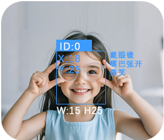

# Face Attribute Recognition

+ When the camera is aimed at a human face, the module can identify three attributes:

Mouth status (open or closed)

Expression (smiling or neutral)

Glasses (wearing or not wearing)

+ Supports recognition of up to** 4 **faces simultaneously, with attribute results displayed for each detected face.

