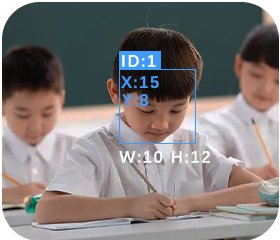

# Face Recognition

+ When a face is detected for the first time (not yet learned), it will be highlighted with a white bounding box.
+ After a face is framed, press the button to start learning and assign an ID (0–3). The learned data is stored in non-volatile memory.
+ Supports learning of up to 4 faces simultaneously.
+ Long-press the button to bring up a confirmation dialog for clearing face data; once confirmed, all learned records will be erased.
+ Learned face data is retained after power-off. If not cleared, the previously stored face data will be automatically loaded at the next startup.

