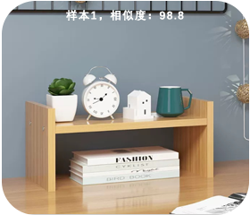

# Deep Learning

+ Supports learning of up to **2 target categories**, with **3 images required per category.**
+ Press the button to start learning the current category:

The top-left corner of the screen displays the category ID.

The top-right corner shows the number of images captured.

+ If no button press occurs within 5s after learning category 0, the module will automatically switch to recognition mode.
+ Once the maximum number of categories is reached, the module will also enter recognition mode either after a 5-second delay or when the button is pressed.
+ In recognition mode, function switching is disabled. To reset the learning data:
1. Long press the button.
2. In the confirmation dialog, select OK to clear all learned data.
+ Deep learning data is not saved after power-off. New training is required after each restart.

