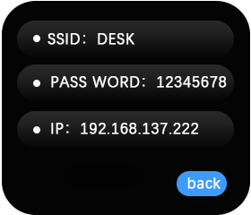
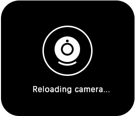

# Wi-Fi Image Transmission
## **QR Code Connection**
+ Before use, ensure a 2.4 GHz Wi-Fi network is available.
+ Connect by scanning the Wi-Fi QR code.
+ After scanning, the screen will first display “Starting Wi-Fi”, then proceed to the IP address display screen once the connection is established.

## **Displaying IP Address**
After a successful connection, the screen will show the `SSID`,  `password`, and assigned`IP address`.

## **Image Transmission Access**
+ Within the same LAN, open any browser and enter the displayed IP address to start image streaming.
+ During streaming, the screen will automatically enter sleep mode for power saving.
+ Rotate or press any button to wake the screen.
+ If the transmission ends, the K210 screen will automatically wake up again.

## **Exiting Image Transmission**
+ After waking the screen, long press the button to open a confirmation dialog and choose Exit Transmission.
+ When the user confirms exit, the screen will briefly display “Reloading camera”, then return to the QR code connection interface.

