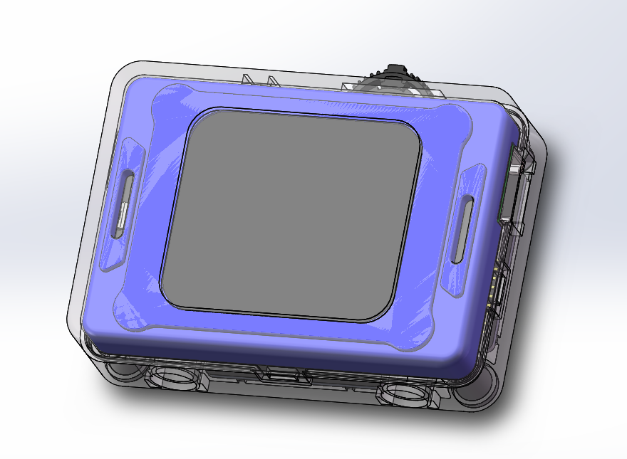
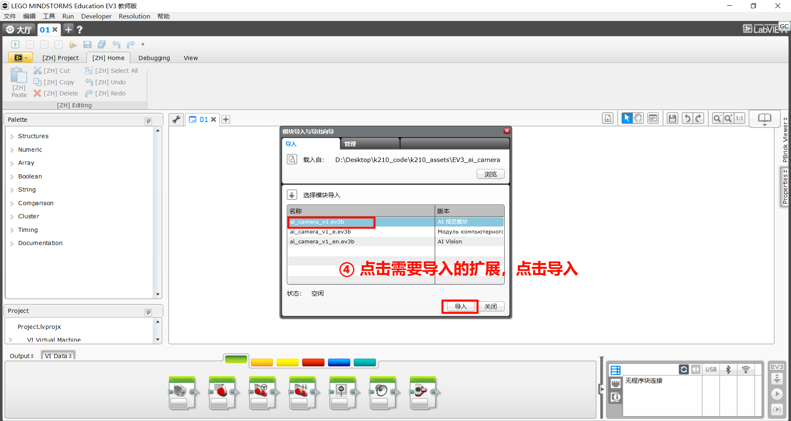
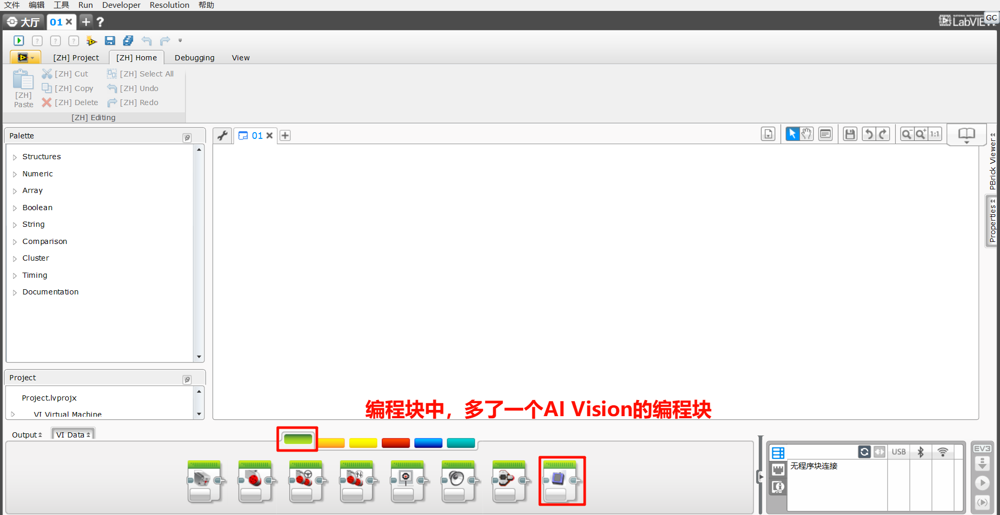

# Extension – EV3
## Introduction

LEGO® MINDSTORMS® EV3 is the third-generation programmable robotics kit in the LEGO MINDSTORMS series. Released in 2013, EV3 was designed for education, makers, and robotics enthusiasts, and is especially suitable for youth to learn programming, engineering, and robotics. It remains widely used in schools, robotics competitions, and personal projects.

## Quick Start
### Hardware Preparation
|  |  |
| :---: | :---: |
| EV3 Controller | K210 AI Vision Sensor |
|  |  |
| Adapter Board | Grove Male-to-Male Cable |
|  |  |
| EV3 Connection Cable |  |

### Software Preparation
LEGO Mindstorms Education EV3 is a professional educational robotics platform designed for classrooms and group learning. This tutorial focuses on using the EV3 platform with the Vision Module.

The Vision Module communicates with EV3 via I²C protocol.

Set the Vision Module to I²C communication mode and connect it to a lower port of the EV3.

#### Getting the Software
Enter [LEGO Mindstorms Education EV3](https://legoeducation.cn/zh-cn/downloads/mindstorms-ev3/software/)

Download and install the version compatible with your computer's operating system.

#### Getting the Extension
For the LEGO Mindstorms Education EV3 programming platform, we've developed a dedicated K210 extension specifically designed for EV3. You can add this extension to your programming platform by **clicking here** to get it.

#### Adding the Extension
The following steps describe how to add the extension to the LEGO Mindstorms Education EV3 programming platform.

Step 1: Click the “Import Module” option from the toolbar.

Step 2: Click “Browse”

Step 3: Select the extension file and click “Open”.

Step 4: Select the extension to be imported, then click “Import”.

Step 5: A dialog box will pop up with the message: “To apply these changes, you must restart the EV3 editor.”

Click OK, then close and restart the EV3 software.

Step 6: A new “Al Vision” programming block has been added to the block palette at the bottom of the interface.

The overall process of adding the extension is as follows:

### Usage Example
Example:

+ Connect the Vision Module to Port 1 and run the program.
+ Press the center button on the EV3 to switch to Tag Recognition Mode.
+ If no tag is detected, the screen will display “None”.
+ If a tag is detected, the screen will display the corresponding Tag ID.

Demonstration:

## Function Block Description

Before use, make sure that the port and function options are selected correctly.

### Get Object ID and Coordinates

Retrieve the following parameters of the recognized object:

ID、Rotation angle、X, Y coordinates、Width and height

Note: Not all detected objects contain a full set of attributes. For attributes not applicable to a specific object, the corresponding field will return 0.

Example:

+ Connect the Vision Module to Port 3.
+ Manually switch to Tag Recognition Mode.
+ The EV3 screen will display the X coordinate of the recognized tag.

### Set Working Mode

Configure the Vision Module to switch between different recognition modes automatically.

Example:

Connect the Vision Module to Port 3 and run the program. The module will automatically switch between Color Recognition mode and Tag Recognition mode at 3-second intervals.

### Get the Number of Recognized Objects

Retrieve the number of objects detected by the Vision Module in the selected mode.

Example:

Connect the Vision Module to Port 3, manually switch to Tag Recognition mode, and run the program. The EV3 screen will display the number of recognized tags.

### Get the RGB Values of a Color

Retrieve the RGB values detected by the Vision Module in Color Recognition mode.

Example:

Connect the Vision Module to Port 3, manually switch to Color Recognition mode, and run the program. The EV3 screen will display the detected R (Red) value of the color.

### Get Face Attributes

Retrieve whether the detected face has the following attributes: mouth open, smiling, or wearing glasses. The value is 1 if true, otherwise 0.

Example:

Connect the Vision Module to Port 3, manually switch to Face Attribute Recognition mode, and run the program.

When the module detects a face with an open mouth, the EV3 screen will display 1; otherwise, it will display 0.

### Face Learning  

Train the module to recognize the currently detected face.

Example:

Connect the Vision Module to Port 3, manually switch to Face Recognition mode, and run the program.

When the Vision Module detects a face, press the center button on the EV3 controller to let the module learn and store the current face.

### Set Target Color for Color Block Tracking

Configure the Vision Module to track a specific color.

A total of 6 colors are available for selection.

Example:  

+ Connect the Vision Module to Port 3, manually switch to Color Block Tracking mode, and run the program.
+ Press the left button on the EV3 controller to start tracking a red color block.
+ Press the right button to start tracking a green color block.

### Set Fill Light Brightness

Adjust the brightness of the fill light.

There are 11 levels available, where 0 means off and 10 represents 100% brightness.

Example:

Before operation, please ensure the fill light has been switched ON in the settings menu.

Connect the Vision Module to Port 3 and run the program:

Press the left button on the EV3 controller → the fill light turns on at 10% brightness.

Press the right button → the fill light turns on at 60% brightness.

### Get Fill Light Brightness

Retrieve the current brightness level of the fill light.

The brightness range is 0 to 10.

Example:

After connecting the Vision Module to Port 3 and running the program, the current brightness value of the fill light will be displayed in real time on the EV3 screen.

You can adjust the brightness through the settings menu.

The displayed value will update simultaneously, providing an intuitive reflection of the current brightness setting.

### Set Fill Light State

Set the ON/OFF state of the fill light.

Example:

Before operation, make sure the fill light brightness is set to greater than 0 in the settings menu.

After connecting the Vision Module to Port 3 and running the program:

Press the left button on the EV3 controller to turn OFF the fill light.

Press the right button on the EV3 controller to turn ON the fill light again.

## Notes
Due to the I²C communication mechanism of EV3, in certain modes, if data is read immediately without an appropriate delay, the retrieved values may be inaccurate.

Therefore, when reading data in these modes, it is recommended to add a delay of about 0.2 seconds to ensure stable communication and obtain correct sensor values.

