# Extension – SPIKE
## Introduction
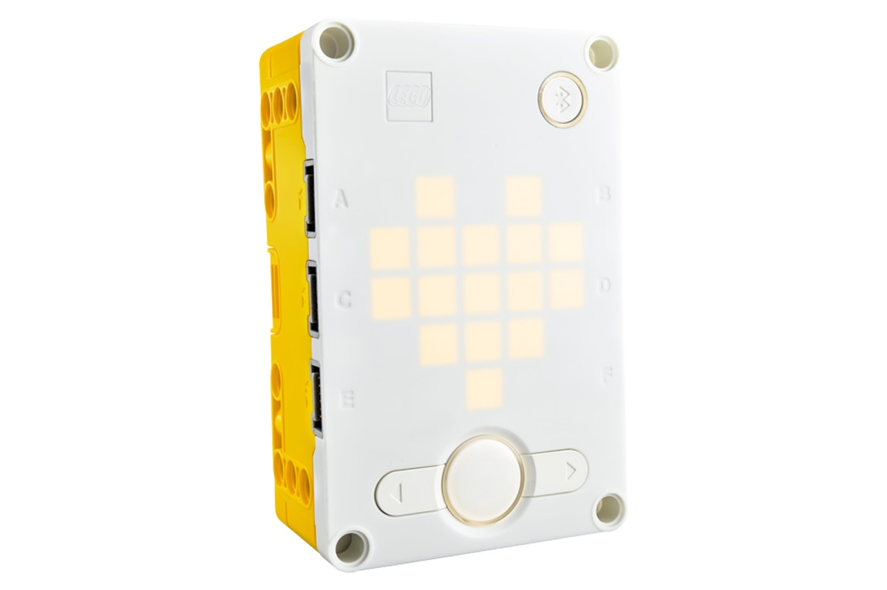

The LEGO SPIKE Prime AI and robotics programming learning series is based on the SPIKE Prime Hub system.

The kit consists of the SPIKE Prime hub, motors, sensors, actuators, and LEGO Technic structural parts.

This document focuses on integrating the vision module with the SPIKE Prime controller.

## Quick Start
Since SPIKE Prime does not allow the addition of custom modules, the vision module simulates a SPIKE color sensor in order to work with SPIKE Prime.

Before use, set the module's port protocol to SPIKE mode.

(Refer to the UI Interface section for operation details. For further details, see SPIKE Compatibility Mode.)

### Hardware Preparation
|  | 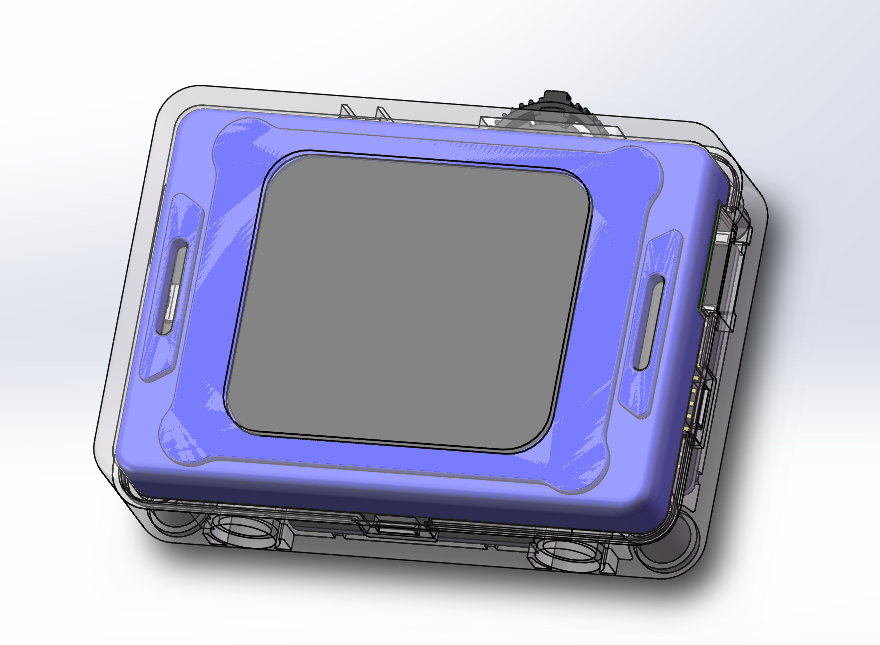 |
| :---: | :---: |
| SPIKE Prime Hub | K210 AI Vision Sensor |
| 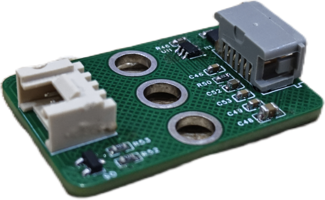 | 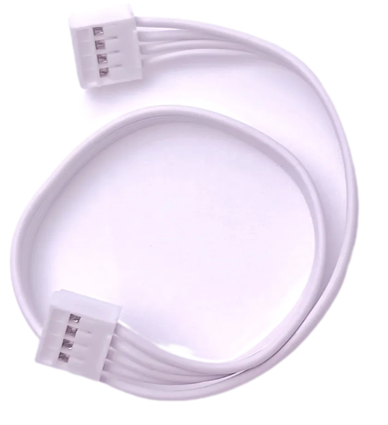 |
| Adapter Board | Grove male-to-male cable |
| 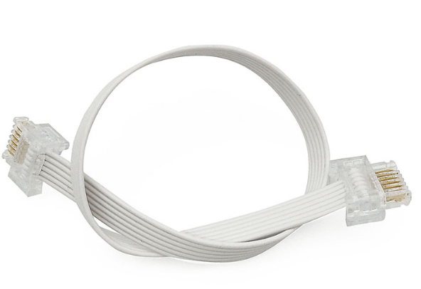 |  |
| Dual-head WeDo 2.0 cable |  |

### Software Preparation
You can enter the [LEGO SPIKE](https://spike.legoeducation.com/) programming page to program the SPIKE Prime Hub. 

1. Go to the LEGO SPIKE webpage.
2. At the bottom right, click SPIKE Prime Essential/Prime Set.

3. Click New Project.

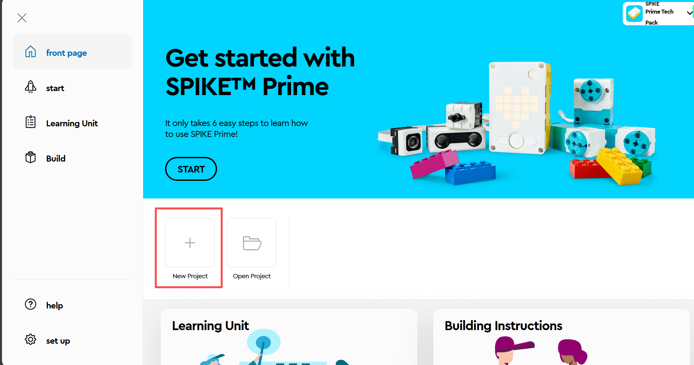

4. Select a programming method you are familiar with. (The following introduces WORD MODULE programming.)

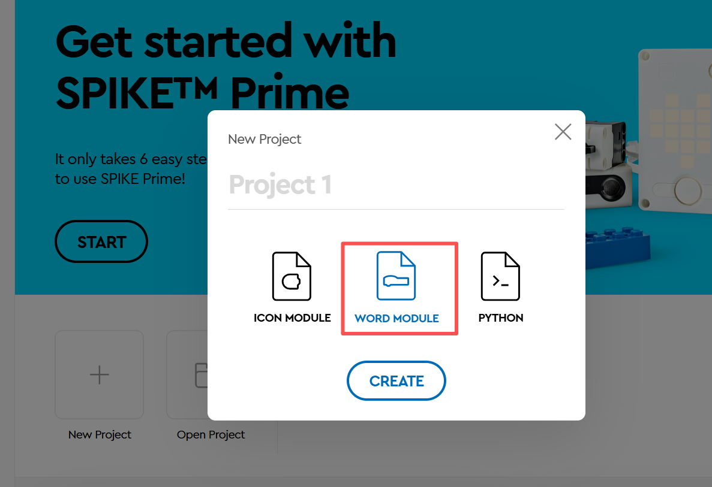

5. Enter the block WORD MODULE interface.

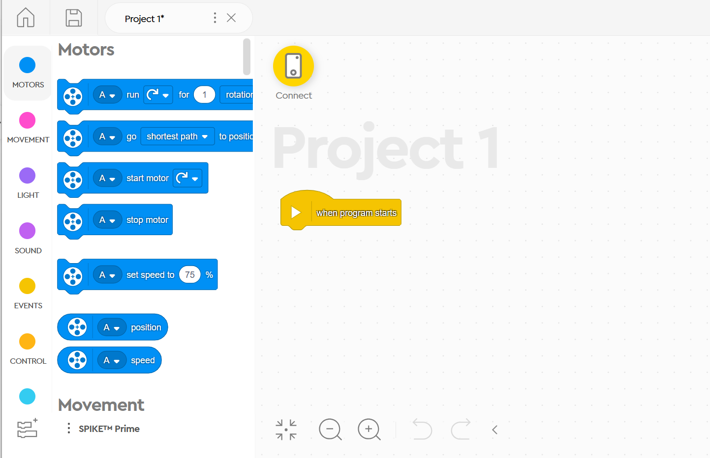

6. Click Show Block Extensions.

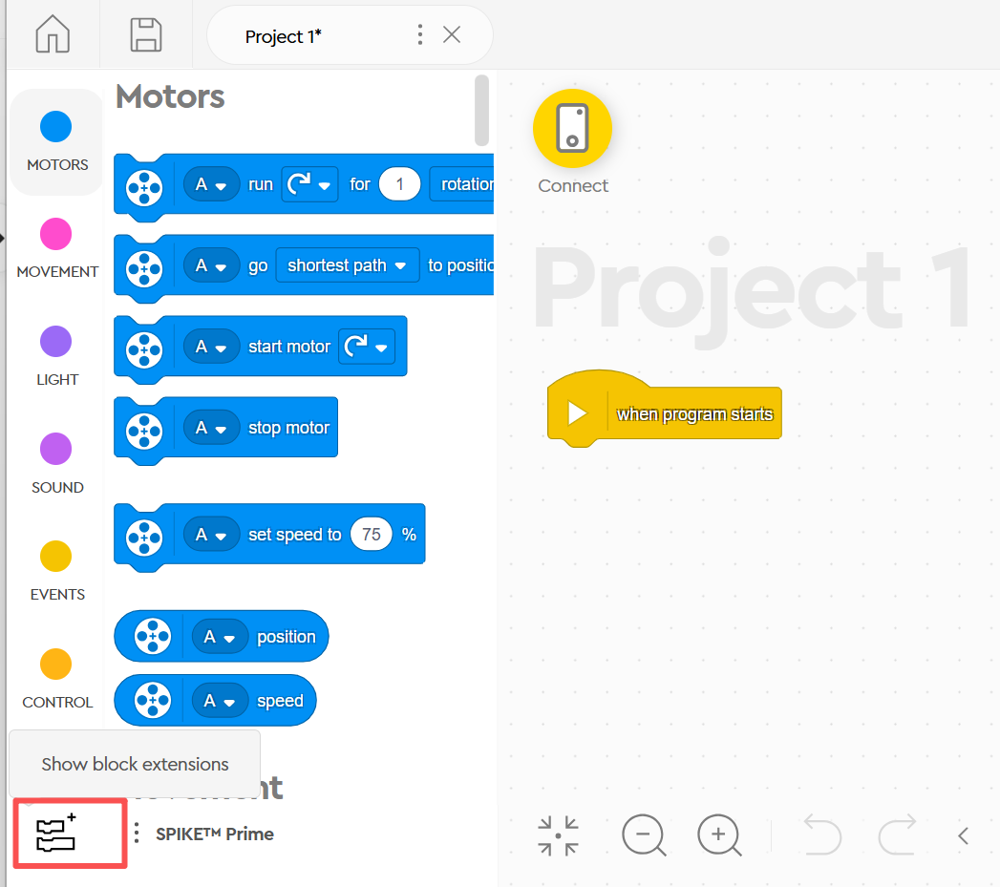

7. Select More Sensor Blocks.

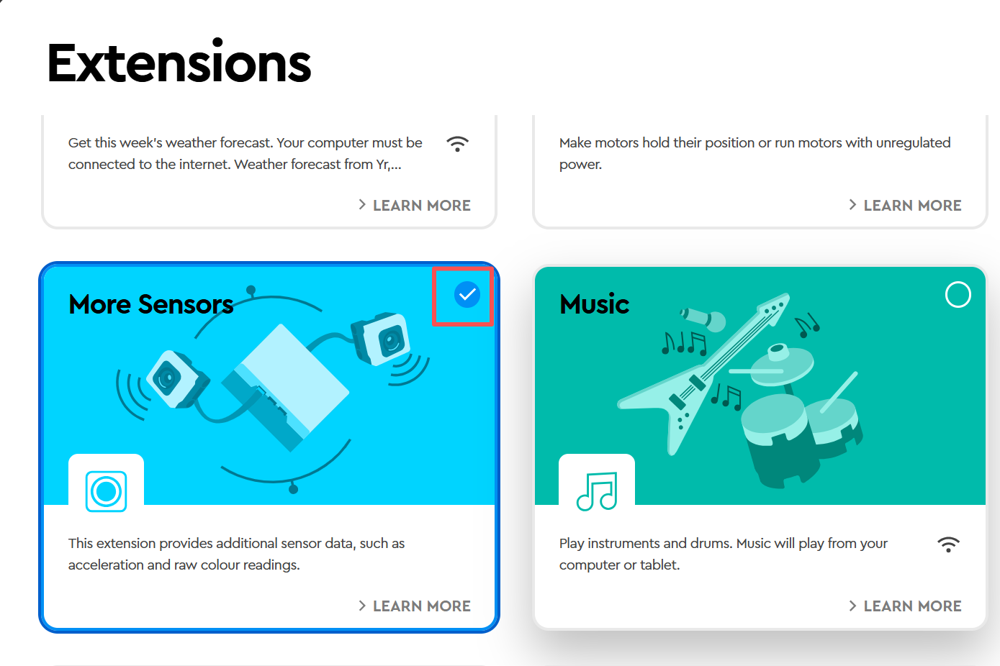

8. In the More Sensor Blocks section, an additional block named Get Color Sensor RGB Value will appear.

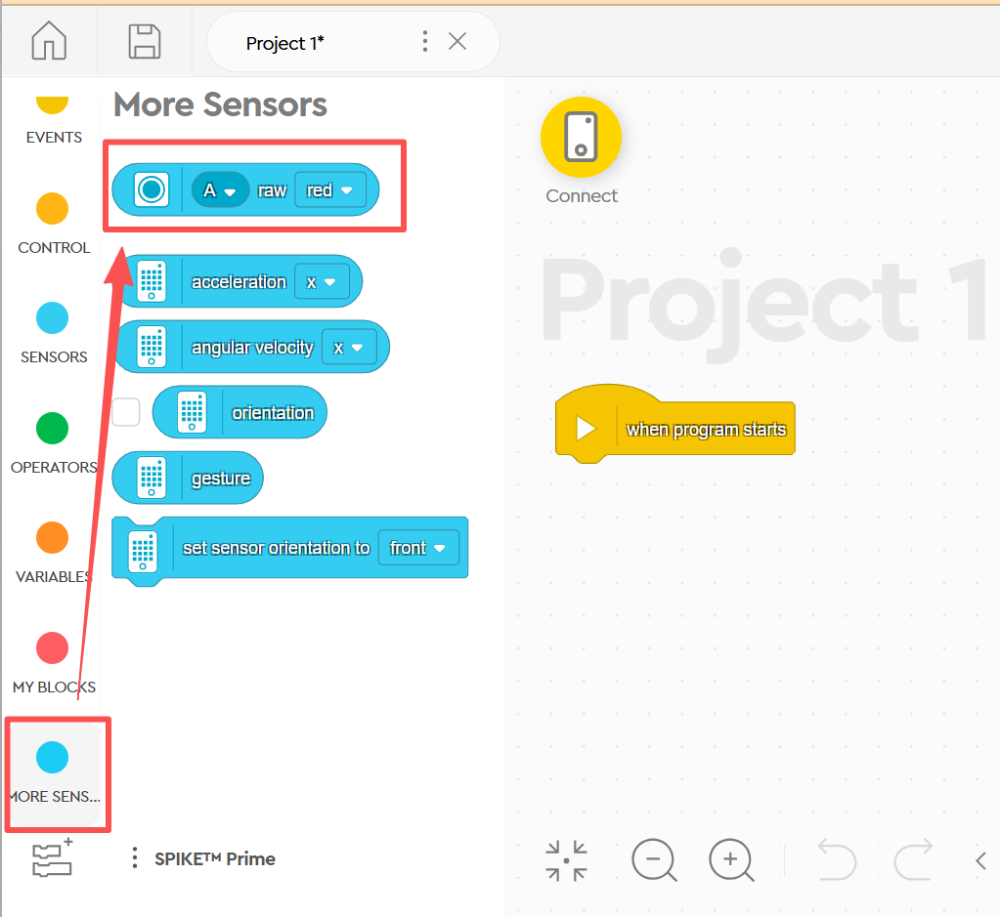

### Usage Example
Connect the vision module to Port A of the SPIKE hub and manually switch it to Tag Recognition Mode.

If no tag is detected, the SPIKE matrix display shows N.

If a tag is detected, the SPIKE matrix display shows the Tag ID.

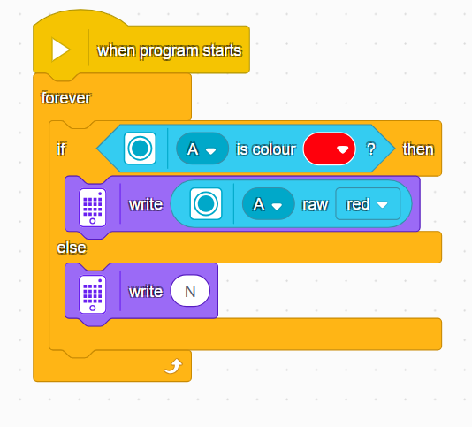

Demonstration:

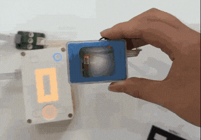

## Usage Instructions  
Since the vision module emulates a color sensor, it is read-only. This means that you can only use the built-in color sensor blocks in SPIKE to read values from the vision module. Mode switching must be done manually on the vision module itself.

The output values of the vision module in different modes correspond directly to the values of the SPIKE color sensor. For detailed mapping, please refer to the SPIKE Compatibility Mode section.

After completing the above steps, connect the vision module to the SPIKE Prime hub. The hub will detect the module as a color sensor, as shown in the figure below:

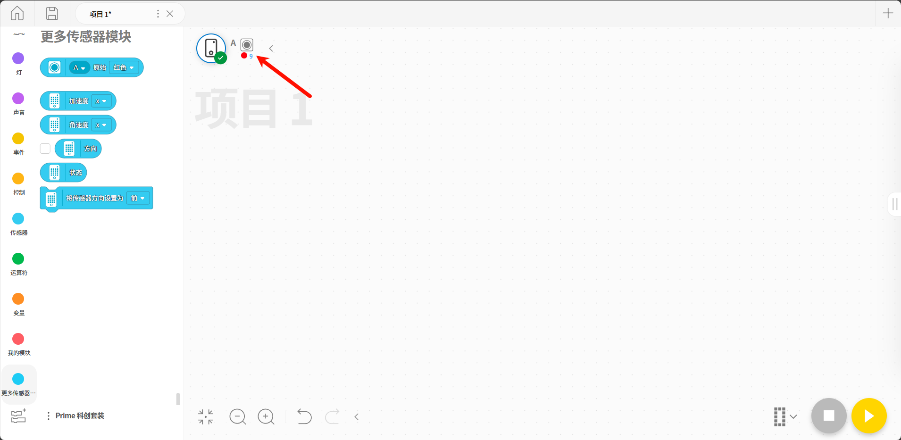

### Color Recognition
1. Switch the vision module to Color Recognition Mode.
2. Read the R value of the detected color from the vision module and display it on the SPIKE Prime hub.

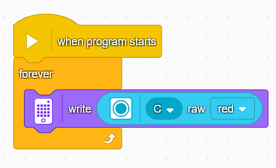

### Color Block Tracking
1. Switch the vision module to Color Block Tracking Mode.
2. If a color block is detected, the x-coordinate of the block will be displayed on the SPIKE Prime hub; otherwise, N will be shown.

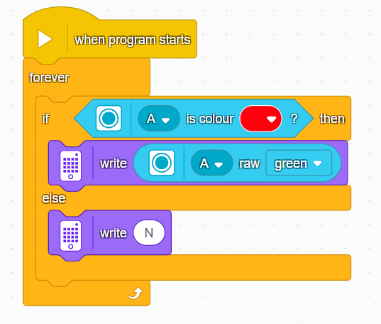

### Tag Recognition
1. Switch the vision module to Tag Recognition Mode.
2. If a tag is detected, the Tag ID will be displayed on the SPIKE Prime hub; otherwise, N will be shown.

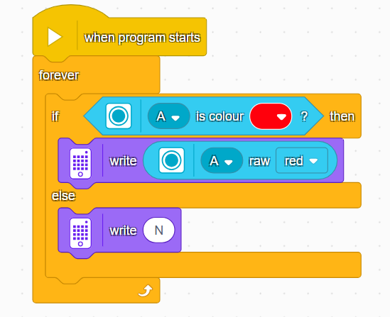

### Line Recognition
1. Switch the vision module to Line Recognition Mode.
2. If a line is detected, the X-coordinate of the line will be displayed on the SPIKE Prime hub; otherwise, N will be shown.

### 20-Class Object Recognition
1. Switch the vision module to 20-Class Object Recognition Mode.
2. If an object is detected, its ID will be displayed on the SPIKE Prime hub; otherwise, N will be shown.

### QR Code Recognition
1. Switch the vision module to QR Code Recognition Mode.
2. If a QR code is detected, its X coordinate will be displayed on the SPIKE Prime hub; otherwise, N will be shown.

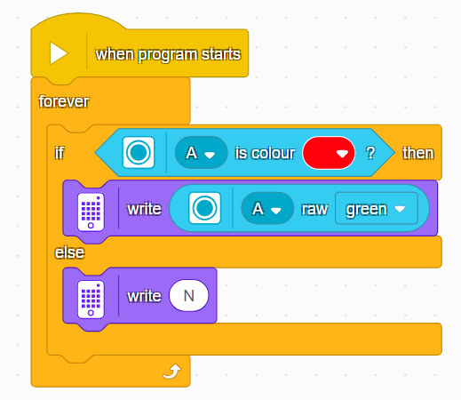

### Face Attribute Recognition
1. Switch the vision module to Face Attribute Recognition Mode.
2. If no face is detected, the SPIKE Prime hub will display N.
3. If a face is detected: Open mouth → `o` Closed mouth → `-`

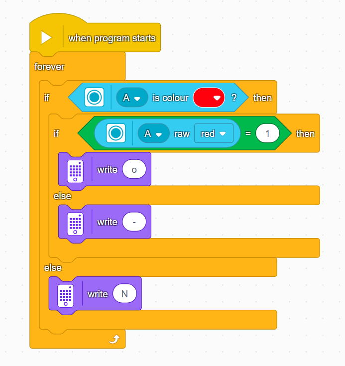

### Face Recognition
1. Switch the vision module to Face Recognition Mode.
2. Manually control the module to learn faces.
3. If no learned face is recognized, the SPIKE Prime hub will display N.
4. If a learned face is recognized, the hub will display the X-coordinate of the detected face.

### Deep Learning
1. Switch the vision module to Deep Learning Mode.
2. Manually control the module to perform deep learning training.
3. If no object is recognized, the SPIKE Prime hub will display N.
4. If an object is recognized, the hub will display the corresponding ID.

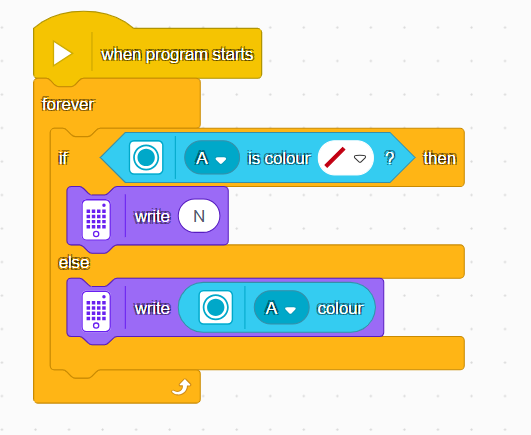

### Road Sign Recognition
1. Switch the vision module to Road Sign Recognition Mode.
2. If no road sign is recognized, the SPIKE Prime hub will display N.
3. If a road sign is recognized, the hub will display the corresponding road sign ID.

