# Extension - Arduino
## Introduction
The Arduino library is written in C++ and communicates with the K210 AI Vision Sensor via the I²C interface.

Based on this library, users can develop programs that achieve higher efficiency and richer functionalities. This tutorial mainly introduces usage through the `Wire` I²C library, but it is not limited to `Wire`. You may also refer to the `override` example to implement usage in other environments.


## Quick Start
### Hardware Requirements  
| 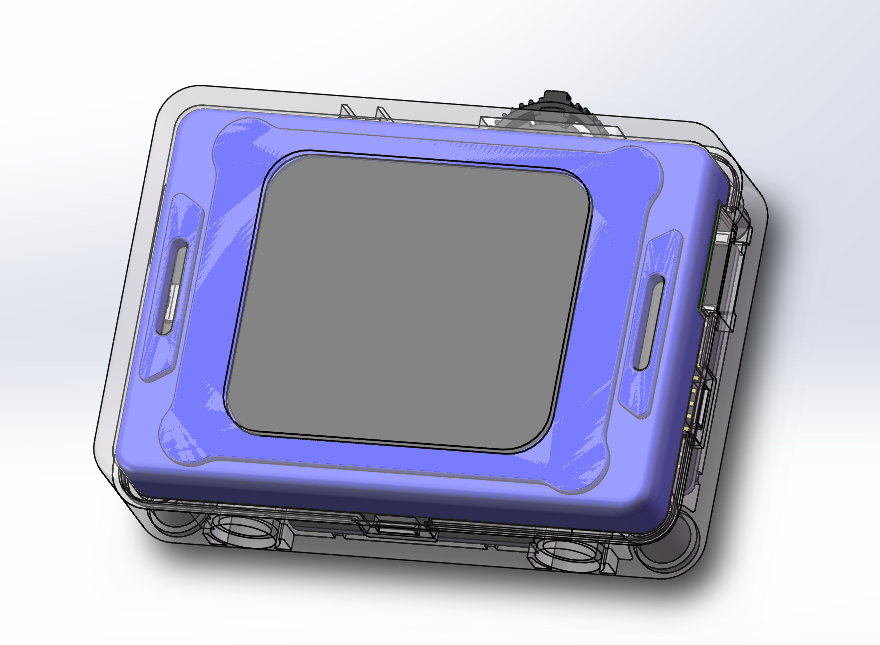 | 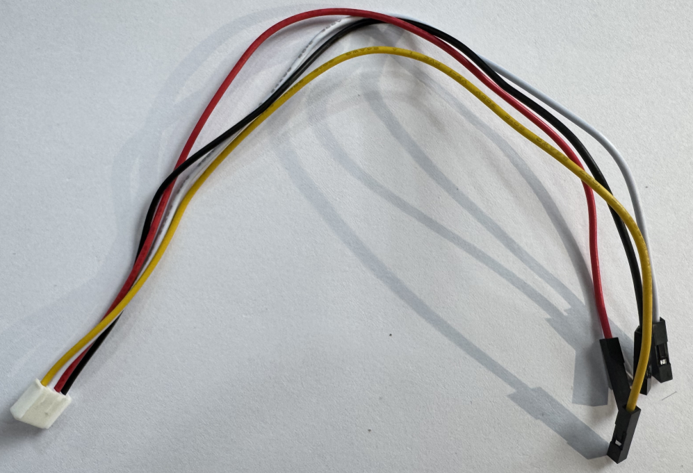 |
| :---: | :---: |
| K210 AI Vision Sensor | Grove to 4-pin Dupont cable |
| 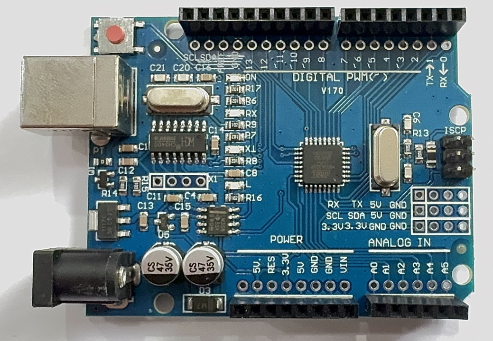 | 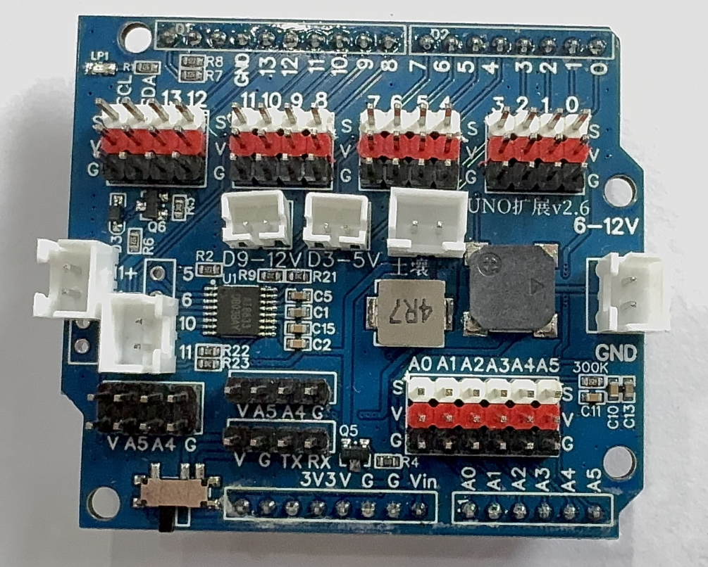 |
| Arduino Uno | Expansion Shield |


Software Requirements

|  | 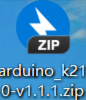 |
| :---: | :---: |
| Arduino IDE | Vision Module API Library |


Refer to the Grove port pin definitions for correct wiring.

### Library Acquisition
You can download the required API library for the vision module from:

#### GitHub：
1. Visit [GitHub](https://github.com/cyc36880/Arduino_k210)
2. Navigate to the Releases section on the lower right.

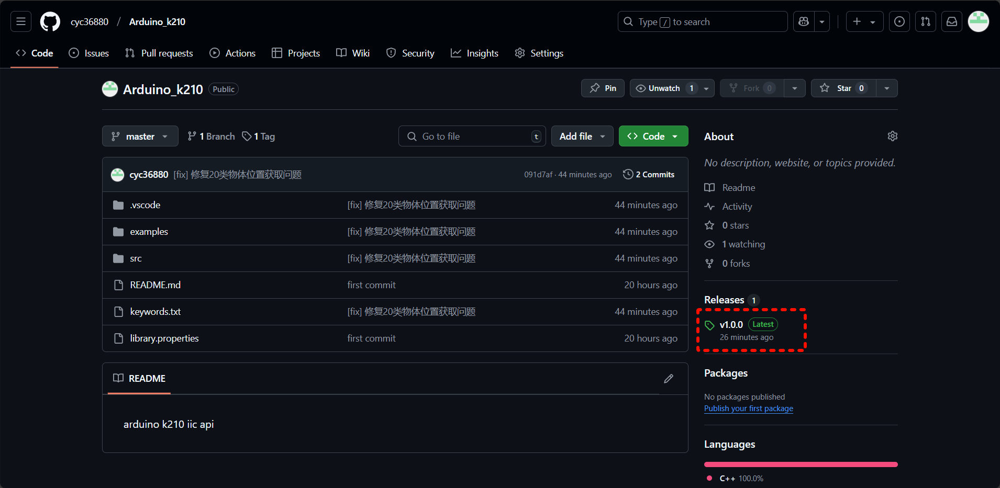

3. Download the latest packaged version.

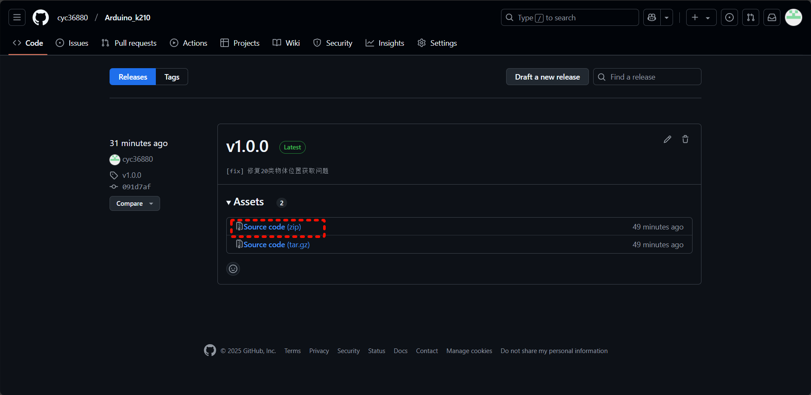

#### Gitee：
1.Visit [Gitee](https://gitee.com/cyc36880/arduino_k210)  
2. Navigate to the Releases section on the lower right.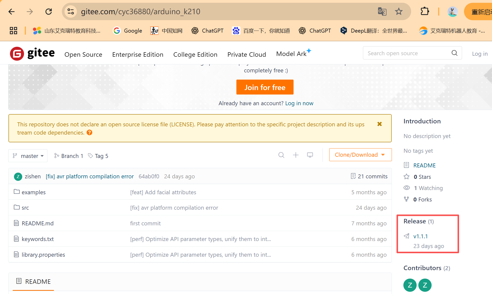

3. Download the latest packaged version.

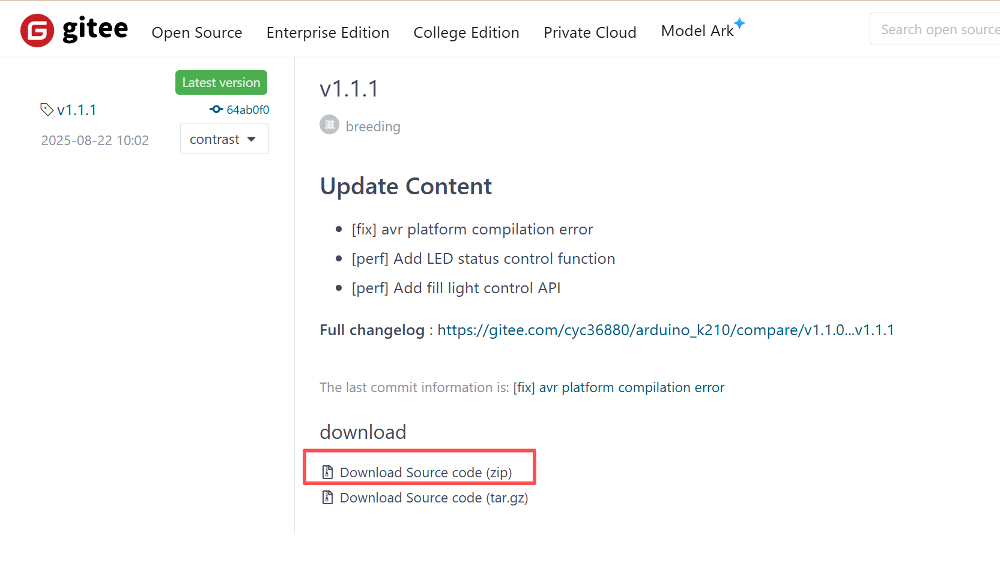


### Importing the Library in Arduino IDE
Step 1: Open the Arduino IDE, create a new project, go to the Sketch menu, select Include Library → Add .ZIP Library...

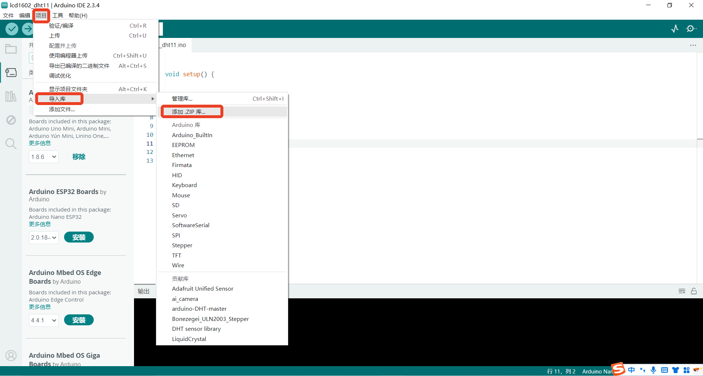

Step 2: Locate the downloaded library file (make sure you have the correct version), select it, and click Open in the bottom-right corner.

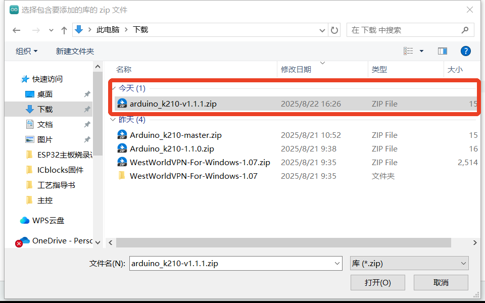

Step 3: In the File menu, navigate to Examples. At the bottom under Examples from Custom Libraries, if you see `ai_camera`, the library has been successfully imported.

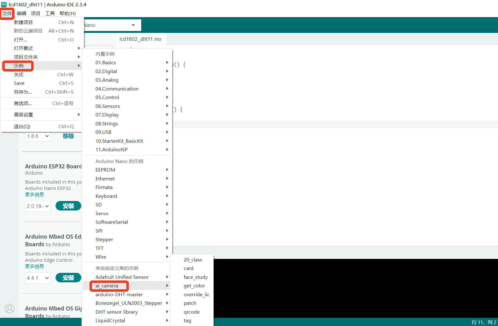

### Examples
The `ai_camera`library provides multiple sample sketches with detailed comments. Together with the API documentation, these examples help you quickly learn how to use the library.

Below is how to open and compile an example to verify your build environment. If the sketch compiles successfully, your environment is set up correctly.


Step 1: The following walkthrough uses 20-Class Object Recognition as the example.

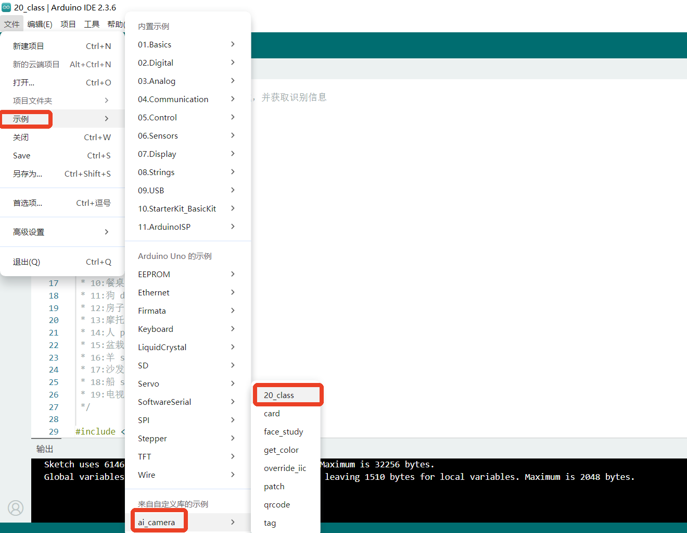

Step 2: Select the development board and the corresponding COM port currently in use, then click OK.

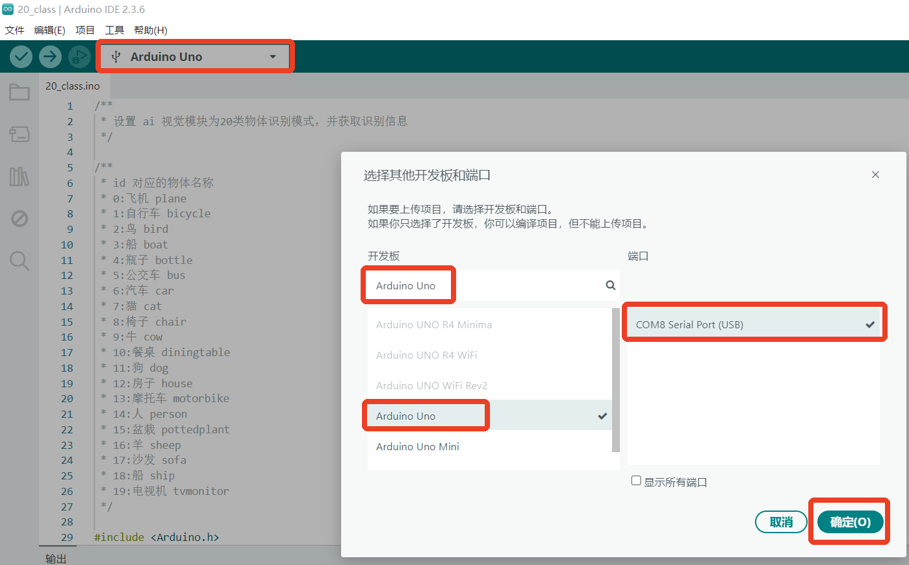

Step 3: Click the Verify/Compile button in the upper-left corner. Wait for the compilation to finish. If successful, the output window will display messages as shown in the highlighted box.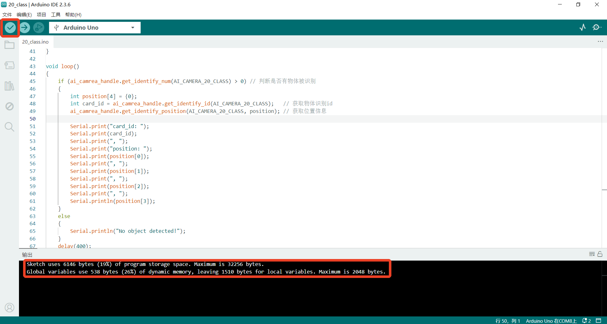

Step 4: Click the Upload button in the upper-left corner. The IDE will first compile, then automatically upload the code to the board. Once uploading is complete, a confirmation message will appear in a popup window as shown in the highlighted box.

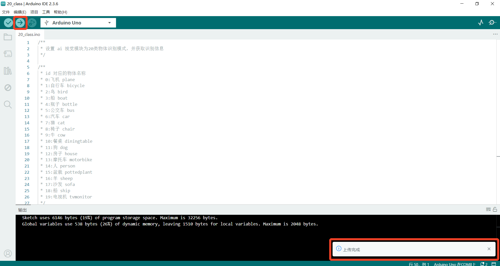

Step 5: Demo Effect

+ The K210 Vision Sensor will recognize objects and label them with their names and position information.

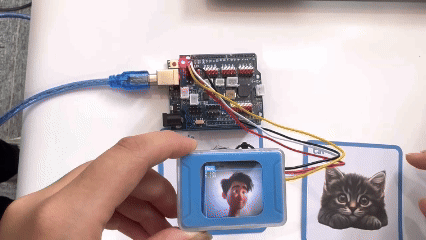


+ Additionally, print the object name and position information to the serial monitor.

card_id maps to the object names (see the figure on the right).

position contains the bounding box: X, Y, W, H.

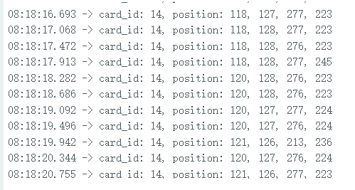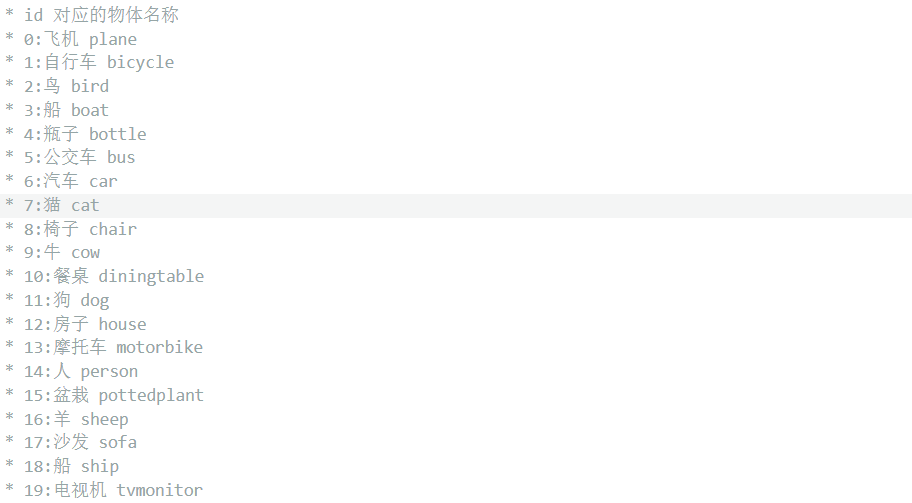


## API
The API is used to operate the Vision Module. Communication with the module follows a specified protocol and requires basic data handling. By using the API, you can abstract away low-level operations and simplify your application logic.

(The examples below take an ESP32 development board as the target platform.)

### Usage Notes  
+ AprilTag generation (Tag Recognition)

You can generate tags using an online [AprilTag generator](https://chaitanyantr.github.io/apriltag.html).

Set Tag Family to`TAG36H11` (this is the family used by the Vision Module).

Set Tag ID as needed (typical range: 0–200).

Print the generated tag and ensure good lighting and focus during testing.

+ QR code generation (QR Code Recognition)

Use any standard QR code generator [website](https://cli.im/) or tool.

Enter the text/content to be encoded and click Generate.

Ensure sufficient print quality and size so the module can decode reliably.

### Class: AiCamera
The AiCamera class is the fundamental object used to operate the AI Vision Module.

#### Constructor
```cpp
class AiCamera(uint8_t addr=0x24)
```

Creates an AiCamera object.

Parameters:

`addr`→ The I²C address of the Vision Module.

Default value: 0x24

Since the AI Vision Module typically uses a single address, the default setting is usually sufficient.

#### Parameter Macros
```cpp
enum Register
{
    AI_CAMERA_COLOR,            // 颜色获取
    AI_CAMERA_PATCH,            // 色块追踪
    AI_CAMERA_TAG,              // 标签识别
    AI_CAMERA_LINE,             // 线条识别
    AI_CAMERA_20_CLASS,         // 20类物体识别
    AI_CAMERA_QRCODE,           // 二维码识别
    AI_CAMERA_FACE_ATTRIBUTE,   // 人脸属性
    AI_CAMERA_FACE_RE,          // 人脸识别
    AI_CAMERA_DEEP_LEARN,       // 深度学习
    AI_CAMERA_CARD,             // 卡片识别
    AI_CAMERA_WIFI_SERVER,      // 无线图传
};
enum Color
{
    AI_CAMERA_COLOR_RED,     // 红色
    AI_CAMERA_COLOR_GREEN,   // 绿色
    AI_CAMERA_COLOR_BLUE,    // 蓝色
    AI_CAMERA_COLOR_YELLOW,  // 黄色
    AI_CAMERA_COLOR_BLACK,   // 黑色
    AI_CAMERA_COLOR_WHITE,   // 白色
};
```

+ These macros are used when switching modes, reading/writing data in a specific mode, and configuring color settings of the Vision Module.

#### Function
##### Init
+ Init(int sda=-1, int scl=-1)

Description:

Initializes the AI Vision Module over the I²C interface.

**Parameters:**

+ sda → I²C data line (SDA).

Default: -1 (use the board’s default SDA pin).

+ scl → I²C clock line (SCL).

Default: -1 (use the board’s default SCL pin).

**Example:**

```cpp
#include <Arduino.h>   // 引入 Arduino 头文件
#include "ai_camera.h" // 引入 ai视觉模块的库头文件

// 设置 ai 视觉模块操作句柄
AiCamera ai_camrea_handle;


void setup()
{
    ai_camrea_handle.Init();   // 初始化
}

void loop()
{
}
```

##### begin
+ begin(int sda=-1, int scl=-1)

> ##### Use the same style as Init to define this function, in order to keep it consistent with the Arduino coding style.

##### set_sys_mode
+ set_sys_mode(uint8_t mode);

Set the working mode of the AI visual module.

**Parameter ：**

+ mode – Operating Mode
    - Refer to Parameter Macros.

**Example:**

```cpp
#include <Arduino.h>   // 引入 Arduino 头文件
#include "ai_camera.h" // 引入 ai视觉模块的库头文件

// 设置 ai 视觉模块操作句柄
AiCamera ai_camrea_handle;


void setup()
{
    ai_camrea_handle.Init();   // 初始化
    // 设置模式为二维码识别模式
    ai_camrea_handle.set_sys_mode(AI_CAMERA_QRCODE); 
}

void loop()
{
}
```


After uploading the code to the development board and resetting the chip, the Vision Module’s operating mode switched from Line Recognition mode to QR Code Recognition mode.

##### get_sys_mode
+ get_sys_mode()

Get the current operating mode of the device

**Return Value:**

AI_CAMERA_COLOR ~ AI_CAMERA_CARD

> Indicates the current mode type. Compare the return value with the Parameter Macros to determine the mode.
>

**Example:**

```cpp
#include <Arduino.h>   // 引入 Arduino 头文件
#include "ai_camera.h" // 引入 ai视觉模块的库头文件

// 设置 ai 视觉模块操作句柄
AiCamera ai_camrea_handle;


void setup()
{
    Serial.begin(115200);      // 初始化串口
    ai_camrea_handle.Init();   // 初始化
}

void loop()
{
    int get_mode = ai_camrea_handle.get_sys_mode(); // 获取系统模式
    if (get_mode == AI_CAMERA_TAG)
    {
        Serial.println("处于标签识别模式");
    }
    else if (get_mode == AI_CAMERA_FACE_ATTRIBUTE)
    {
        Serial.println("处于人脸检测模式");
    }
    else
    {
        Serial.println("其它模式");
    }
    delay(400);
}
```


When switching modes using the rotary dial, if you switch to Tag Recognition mode or Face Detection mode, the serial monitor will print the corresponding mode name.

##### get_color_rgb
+ get_color_rgb(int rgb[3])

Retrieves the RGB values from the Color Recognition mode.

**Parameters:**

+ rgb[3] → An integer array of size 3, used as the RGB buffer.

**Example:**

```cpp
#include <Arduino.h>   // 引入 Arduino 头文件
#include "ai_camera.h" // 引入 ai视觉模块的库头文件

// 设置 ai 视觉模块操作句柄
AiCamera ai_camrea_handle;


void setup()
{
    Serial.begin(115200);      // 初始化串口
    ai_camrea_handle.Init();   // 初始化
    // 切换模式到颜色获取模式
    ai_camrea_handle.set_sys_mode(AI_CAMERA_COLOR); 
    delay(1000);                    // 等待切换完成
}

void loop()
{
    int rgb[3] = {0}; // rgb数组数据缓冲区
    ai_camrea_handle.get_color_rgb(rgb); // 获取rgb数据
    Serial.print("rgb:(");
    Serial.print(rgb[0]);
    Serial.print(" ");
    Serial.print(rgb[1]);
    Serial.print(" ");
    Serial.print(rgb[2]);
    Serial.println(")");

    delay(400);
}
```


In the center of the visual module is a white rectangular box, which is used for color extraction.

Below the white box, the screen displays the extracted RGB value in real time, which is consistent with the result of serial port printing output.

##### get_color_rgb
+ get_color_rgb(int &r, int &g, int &b)


**Parameters:**

+ r → Reference to an integer storing the Red value
+ g → Reference to an integer storing the Green value
+ b → Reference to an integer storing the Blue value


** Example:**

```cpp
#include <Arduino.h>   // 引入 Arduino 头文件
#include "ai_camera.h" // 引入 ai视觉模块的库头文件

// 设置 ai 视觉模块操作句柄
AiCamera ai_camrea_handle;


void setup()
{
    Serial.begin(115200);      // 初始化串口
    ai_camrea_handle.Init();   // 初始化
    // 切换模式到颜色获取模式
    ai_camrea_handle.set_sys_mode(AI_CAMERA_COLOR); 
    delay(1000);                    // 等待切换完成
}

void loop()
{
    int r, g, b; // 
    ai_camrea_handle.get_color_rgb(r, g, b); // 获取rgb数据
    Serial.print("rgb:(");
    Serial.print(r);
    Serial.print(" ");
    Serial.print(g);
    Serial.print(" ");
    Serial.print(b);
    Serial.println(")");

    delay(400);
}
```

> Use the reference to the previous function of the same name
>

##### set_find_color
+ set_find_color(uint8_t color_id)

Sets the target color for Color Block Tracking mode.

**Parameters:**

+ color_id →The color to be tracked. Options:
    - AI_CAMERA_COLOR_RED      // Red
    - AI_CAMERA_COLOR_GREEN //  Green  
    - AI_CAMERA_COLOR_BLUE    //  Blue  
    - AI_CAMERA_COLOR_YELLOW // Yellow
    - AI_CAMERA_COLOR_BLACK   //  Black  
    - AI_CAMERA_COLOR_WHITE  // White

** Example:**

```cpp
#include <Arduino.h>   // 引入 Arduino 头文件
#include "ai_camera.h" // 引入 ai视觉模块的库头文件

// 设置 ai 视觉模块操作句柄
AiCamera ai_camrea_handle;


void setup()
{
    Serial.begin(115200);      // 初始化串口
    ai_camrea_handle.Init();   // 初始化
    // 切换模式到色块追踪模式
    ai_camrea_handle.set_sys_mode(AI_CAMERA_PATCH); 
    delay(1000);                    // 等待切换完成
    ai_camrea_handle.set_find_color(AI_CAMERA_COLOR_GREEN);// 设置追踪绿色
}

void loop()
{
}
```


After uploading the code to the development board and resetting the chip, the Vision Module switches from Color Recognition mode to Color Block Tracking mode, and the top-right indicator updates to show the tracking color as Green.

##### face_study
+ face_study()

Trigger Face Recognition Learning

> It learns only when a face is recognized, otherwise the instruction is invalid
>
> After learning, the ID of the current face is automatically assigned, ranging from 0 to 3. If more than 4 are exceeded, it will be overwritten from 0
>


**Example:**

```cpp
#include <Arduino.h>   // 引入 Arduino 头文件
#include "ai_camera.h" // 引入 ai视觉模块的库头文件

// 设置 ai 视觉模块操作句柄
AiCamera ai_camrea_handle;

void setup()
{
    Serial.begin(115200);      // 初始化串口
    ai_camrea_handle.Init();   // 初始化
    // 切换模式到人脸识别模式
    ai_camrea_handle.set_sys_mode(AI_CAMERA_FACE_RE); 
    delay(1000);                    // 等待切换完成
    ai_camrea_handle.face_study();  // 人脸学习
}

void loop()
{
}
```


Upload the code to the development board, and reset the chip when the visual module can recognize the face. The visual module switches from color recognition mode to face recognition mode and learns the recognized face. The white box of the face is switched to orange box, and an ID is assigned to it.

##### deep_learn_study
+ deep_learn_study()

Make deep recognition learning

> Take a series of photos when the photo is longer than 5s or the category exceeds 4, and enter recognition mode
>


**Example:**

```cpp
#include <Arduino.h>   // 引入 Arduino 头文件
#include "ai_camera.h" // 引入 ai视觉模块的库头文件

// 设置 ai 视觉模块操作句柄
AiCamera ai_camrea_handle;


void setup()
{
    Serial.begin(115200);      // 初始化串口
    ai_camrea_handle.Init();   // 初始化
    // 切换模式到深度识别模式
    ai_camrea_handle.set_sys_mode(AI_CAMERA_DEEP_LEARN); 
    delay(1000);                          // 等待切换完成
    ai_camrea_handle.deep_learn_study();  // 深度学习
}

void loop()
{
}
```


Upload the code to the development board, reset the chip, and switch the vision module to deep learning mode and carry out deep learning.

##### get_face_attributes
+ get_face_attributes(int &is_male, int &is_mouth_open, int &is_smail, int &is_glasses, uint8_t index=0)

Obtain face attributes


**Parameters:**

+ is_male → Whether the face is male
+ is_mouth_open → Whether the mouth is open
+ is_glasses → Whether glasses are worn
+ index → The index of the detected face (default: the first face)

**Example:**

```cpp
#include <Arduino.h>    // 引入 Arduino 头文件
#include "ai_camera.h"  // 引入 ai视觉模块的库头文件

// 设置 ai 视觉模块操作句柄
AiCamera ai_camrea_handle;

void setup() 
{
    Serial.begin(115200); // 初始化串口
    ai_camrea_handle.begin();    // 初始化
    ai_camrea_handle.set_sys_mode(AI_CAMERA_FACE_ATTRIBUTE); // 设置模式为人脸属性识别模式
    delay(1000); // 等待切换完成
}

void loop() 
{
    // 判断是否找到人脸
    if (ai_camrea_handle.get_identify_num(AI_CAMERA_FACE_ATTRIBUTE) > 0)
    {
        // 获取人脸属性
        int is_male, is_mouth_open, is_smail, is_glasses;
        ai_camrea_handle.get_face_attributes(is_male, is_mouth_open, is_smail, is_glasses);
        Serial.print("is_male: ");
        Serial.print(is_male);
        Serial.print(", is_mouth_open: ");
        Serial.print(is_mouth_open);
        Serial.print(", is_smail: ");
        Serial.print(is_smail);
        Serial.print(", is_glasses: ");
        Serial.println(is_glasses);
    }
    else
    {
        Serial.println("No face detected.");
    }

    delay(400);
}
```

##### get_identify_num
+ get_identify_num(uint8_t features, uint8_t total=0)

Get the number of identifications or whether the identification was made


**Parameters:  **

+ features → Feature selection
    - AI_CAMERA_PATCH   # Color Block Tracking
    - AI_CAMERA_TAG     # Tag Recognition
    - AI_CAMERA_LINE    # Line Recognition
    - AI_CAMERA_20_CLASS# 20-Class Object Recognition
    - AI_CAMERA_QRCODE  # QR Code Recognition
    - AI_CAMERA_FACE_ATTRIBUTE # Face Attribute Recognition
    - AI_CAMERA_FACE_RE # Face Recognition
    - AI_CAMERA_DEEP_LEARN # Deep Learning
    - AI_CAMERA_CARD # Card Recognition
+ total → Total number of recognized objects

> In Face Recognition mode:
>
> total = 0 (default) → Returns the number of learned faces detected.
>
> total = 1 → Returns the total number of faces detected on screen (both learned and unlearned).
>
> In other modes: This parameter is ignored.
>

**Return Value:**

+ In Color Block Tracking, Line Recognition, QR Code Recognition, and Deep Learning modes:

Returns 1 if an object is recognized.

Returns 0 if no object is recognized.

+ In Tag Recognition, 20-Class Object Recognition, Face Attribute, and Card Recognition modes:

Returns the number of objects recognized.

> In Face Recognition mode:
>
> Default returns the number of learned faces recognized.
>
> If total = 1, returns the total number of faces (learned + unlearned).
>

**Example:**

```cpp
#include <Arduino.h>   // 引入 Arduino 头文件
#include "ai_camera.h" // 引入 ai视觉模块的库头文件

// 设置 ai 视觉模块操作句柄
AiCamera ai_camrea_handle;


void setup()
{
    Serial.begin(115200);      // 初始化串口
    ai_camrea_handle.Init();   // 初始化
    // 切换模式到色块追踪模式
    ai_camrea_handle.set_sys_mode(AI_CAMERA_PATCH); 
    delay(1000);                          // 等待切换完成
    ai_camrea_handle.set_find_color(AI_CAMERA_COLOR_GREEN);// 设置追踪绿色
}

void loop()
{
    // 判断是否找到色块
    if (ai_camrea_handle.get_identify_num(AI_CAMERA_PATCH) > 0)
    {
        Serial.println("find patch");
    }
    else
    {
        Serial.println("no find patch");
    }
    delay(400);
}
```


When the visual module recognizes a green object, it boxes it out and prints "find patch" on the serial port. If no green object is recognized, it prints "no find patch" on the serial port.


##### get_qrcode_content
+ get_qrcode_content()

Get the content identified by the QR code


**Return Value:**

Returns a string (std::string type).


**Example:**

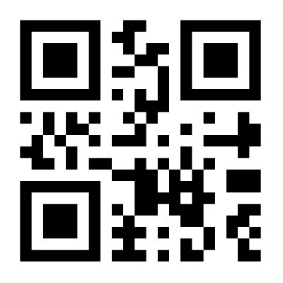

A QR code with the content "hello".

```cpp
#include <Arduino.h>   // 引入 Arduino 头文件
#include "ai_camera.h" // 引入 ai视觉模块的库头文件

// 设置 ai 视觉模块操作句柄
AiCamera ai_camrea_handle;

void setup()
{
    Serial.begin(115200);      // 初始化串口
    ai_camrea_handle.Init();   // 初始化
    // 切换模式到二维码识别模式
    ai_camrea_handle.set_sys_mode(AI_CAMERA_QRCODE); 
    delay(1000);              // 等待切换完成
}

void loop()
{
    // 判读是否找到二维码
    if (ai_camrea_handle.get_identify_num(AI_CAMERA_QRCODE) > 0)
    {
        // 获取二维码内容
        std::string qrcode_content = ai_camrea_handle.get_qrcode_content(); 
        Serial.print("qrocde content: ");
        Serial.println(qrcode_content);
    }
    else
    {
        Serial.println("no find qrcode");
    }
    delay(400);
}
```


When the visual module recognizes the QR code generated by the QR code generation tool with the content "hello", it prints "qrcode content: hello" through the serial port. If the QR code is not recognized, it prints "no find qrcode" through the serial port.

##### get_identify_id
+ get_identify_id(uint8_t features, uint8_t index=0)

Get the ID of the object being recognized

> Interpretation of id in Different Modes
>
> + Color Block Tracking 
>
> id = 1 ~ 6, representing Red, Green, Blue, Yellow, Black, White.
>
> You can use the color macros defined in class AiCamera to judge.
>
> (Note: this value reflects the set color id, regardless of whether the block is detected.)
>
> + Tag Recognition 
> + id = 0 ~ …, corresponds to the tag ID defined when generating the AprilTag
> + 20-Class Object Recognition
>
> id = 0 ~ 19, representing:
>
> "airplane", "bicycle", "bird", "boat", "bottle", "bus", "car", "cat", "chair", "cow", "dining table", "dog", "house", "motorbike", "person", "potted plant", "sheep", "sofa", "train", "tv monitor".
>
> + Face Recognition / Deep Learning
>
> id = 0 ~ 3, automatically assigned in order when learning.
>
> + Card Recognition 
>
> id = 0 ~ 6, representing:
>
> Green Light, Left Turn, Stop, Red Light, Right Turn, Horn, Target.
>


**Parameters:**

+ features — Function selection

AI_CAMERA_PATCH — Color Block Tracking (single)

AI_CAMERA_TAG — Tag Recognition (single)

AI_CAMERA_20_CLASS — 20-Class Object Recognition (multi)

AI_CAMERA_FACE_RE — Face Recognition (multi)

AI_CAMERA_DEEP_LEARN — Deep Learning (single)

AI_CAMERA_CARD — Card Recognition (multi)

+ index — Index of the recognized object
    - Range: 0 ~ 3
    - Only meaningful in multi-object recognition modes (20-Class, Face, Card).

**Return Value:**

id of the recognized object.

Meaning depends on the selected mode (see explanation above).

<font style="color:rgb(38, 38, 38);">Example 1: Judge the Recognized Tag ID</font>

| 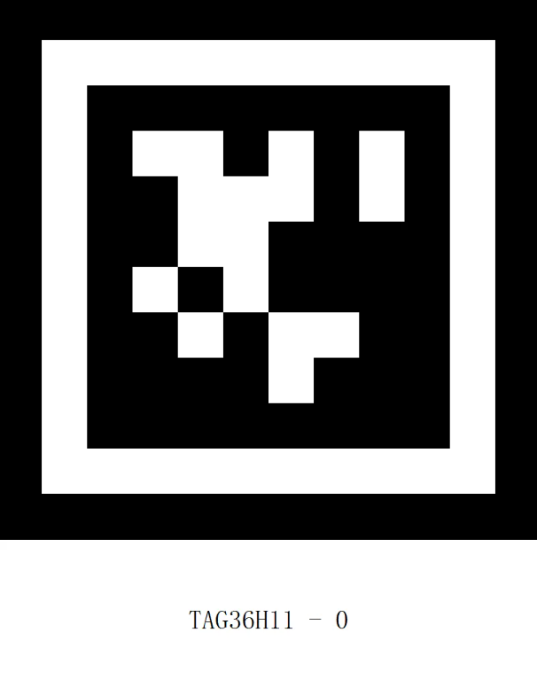 | 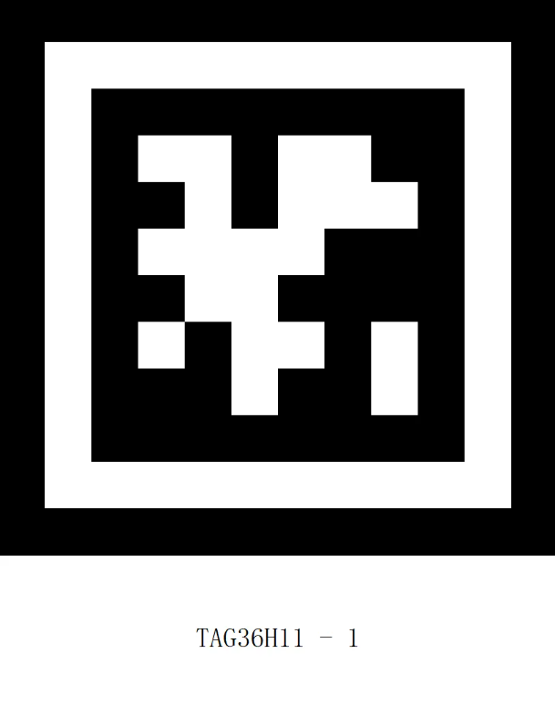 | 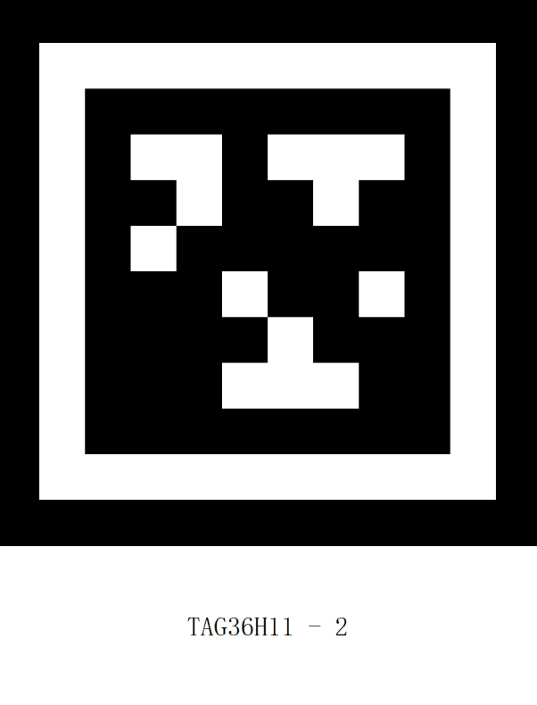 |
| --- | --- | --- |
| 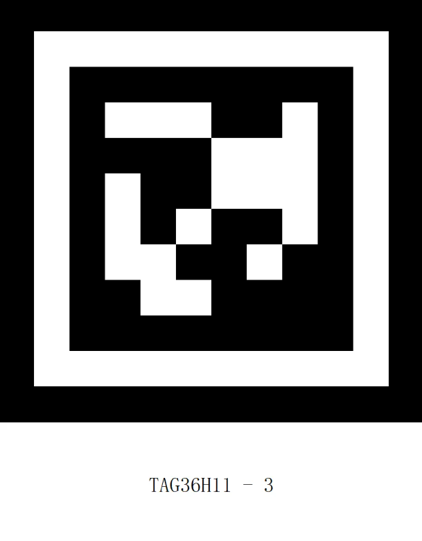 | 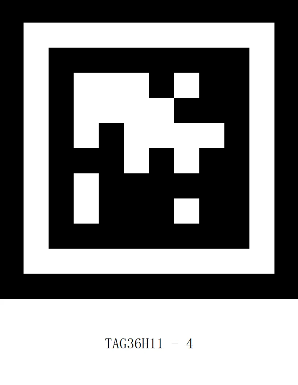 | 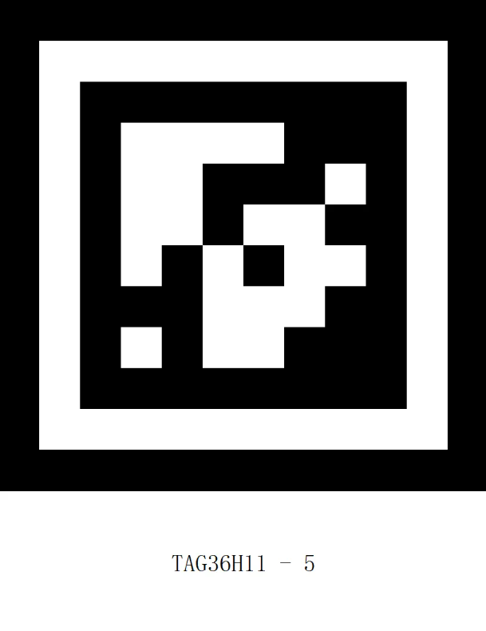 |
| 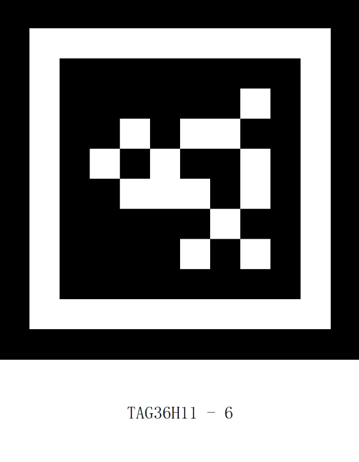 |  | 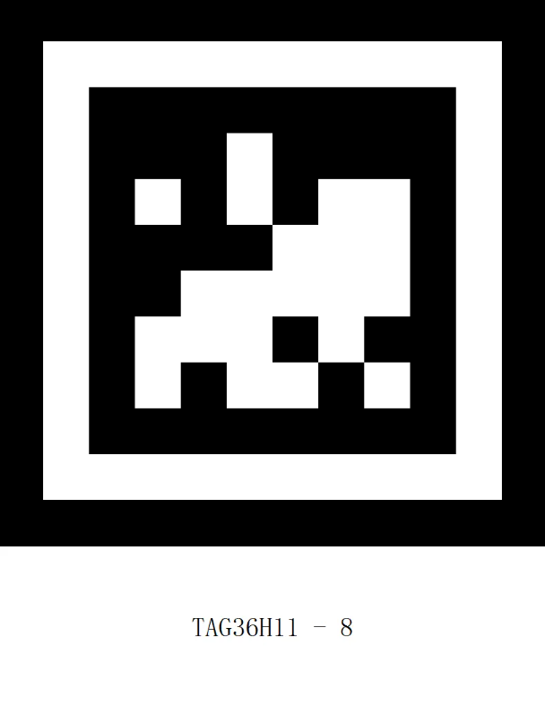 |


<font style="color:rgb(38, 38, 38);">ID tags from 0 to 8.</font>

<font style="color:rgb(38, 38, 38);"></font>

```cpp
#include <Arduino.h>   // 引入 Arduino 头文件
#include "ai_camera.h" // 引入 ai视觉模块的库头文件

// 设置 ai 视觉模块操作句柄
AiCamera ai_camrea_handle;

void setup()
{
    Serial.begin(115200);      // 初始化串口
    ai_camrea_handle.Init();   // 初始化
    // 切换模式到标签识别模式
    ai_camrea_handle.set_sys_mode(AI_CAMERA_TAG); 
    delay(1000);               // 等待切换完成
}

void loop()
{
    // 判读是否找到标签
    if (ai_camrea_handle.get_identify_num(AI_CAMERA_TAG) > 0)
    {
        // 获取标签id
        int target_id = ai_camrea_handle.get_identify_id(AI_CAMERA_TAG);
        Serial.print("tag id: ");
        Serial.println(target_id);
    }
    else
    {
        Serial.println("no find tag");
    }
    delay(400);
}
```


When the visual module does not recognize the tag, it prints "no find tag" on the serial port. When the tag is recognized, it prints the ID of the tag.

****

**Example 2: Judge Recognized 20-Class Objects**

|  |  |
| :---: | :---: |


<font style="color:rgb(38, 38, 38);">"Bike" and "car" pictures.</font>

<font style="color:rgb(38, 38, 38);"></font>

```cpp
#include <Arduino.h>   // 引入 Arduino 头文件
#include "ai_camera.h" // 引入 ai视觉模块的库头文件

// 设置 ai 视觉模块操作句柄
AiCamera ai_camrea_handle;


void setup()
{
    Serial.begin(115200);      // 初始化串口
    ai_camrea_handle.Init();   // 初始化
    // 切换模式到20类物体识别模式
    ai_camrea_handle.set_sys_mode(AI_CAMERA_20_CLASS); 
    delay(1000);               // 等待切换完成
}

void loop()
{
    // 判读是否找到20类物体
    if (ai_camrea_handle.get_identify_num(AI_CAMERA_20_CLASS) > 0)
    {
        // 获取20类物体id
        uint8_t target_id = ai_camrea_handle.get_identify_id(AI_CAMERA_20_CLASS);
        if (target_id == 1)
        {
            Serial.println("识别到自行车");
        }
        else
        {
            Serial.println("其他物体");
        }
    }
    else
    {
        Serial.println("no find 20 class");
    }
    delay(400);
}
```


When the vision module recognizes "bicycle", it prints "recognized bicycle" on the serial port; when the vision module recognizes "car", it prints "other objects" on the serial port; when no objects matching the 20 categories are recognized, it prints "no find 20 class".

##### <font style="color:rgb(38, 38, 38);">get_identify_rotation</font>
+ get_identify_rotation(uint8_t features, uint8_t index=0)

Get the rotation Angle of the object being identified

> Currently, only the tag recognition mode supports the rotation Angle. The value obtained by other modes is always 0
>


**Parameter **

+ features function selection
    - AI_CAMERA_TAG     # Tag Recognition
+ index: which object the index identifies
    - The default is 0. Generally, 0 is ok. This parameter is reserved for future functional extensions


**Return Value:**

0~359

**Example:**

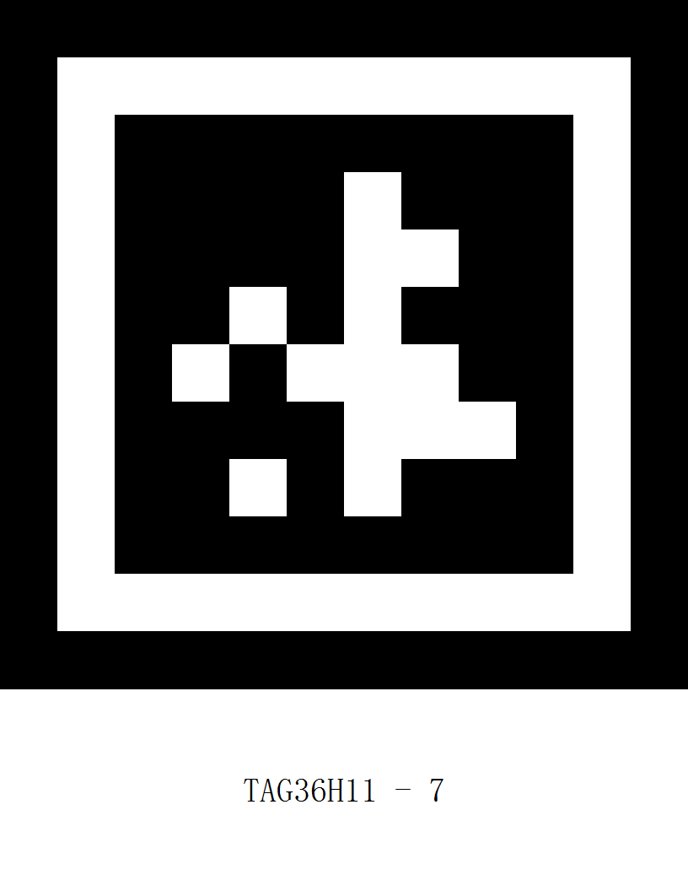

```cpp
#include <Arduino.h>   // 引入 Arduino 头文件
#include "ai_camera.h" // 引入 ai视觉模块的库头文件

// 设置 ai 视觉模块操作句柄
AiCamera ai_camrea_handle;

void setup()
{
    Serial.begin(115200);      // 初始化串口
    ai_camrea_handle.Init();   // 初始化
    // 切换模式到标签识别模式
    ai_camrea_handle.set_sys_mode(AI_CAMERA_TAG); 
    delay(1000);               // 等待切换完成
}

void loop()
{
    // 判读是否找到标签
    if (ai_camrea_handle.get_identify_num(AI_CAMERA_TAG) > 0)
    {
        // 获取标签旋转角度
        int rot = ai_camrea_handle.get_identify_rotation(AI_CAMERA_TAG);
        Serial.print("rot: ");
        Serial.println(rot);
    }
    else
    {
        Serial.println("no find tag");
    }
    delay(400);
}
```


<font style="color:rgb(38, 38, 38);">When the visual module recognizes the tag, rotate the visual module and print the Angle of the tag relative to the visual module through the serial port. If the tag is not recognized, print "no find tag" through the serial port.</font>

##### <font style="color:rgb(38, 38, 38);">get_identify_position</font>
+ <font style="color:rgb(38, 38, 38);">get_identify_position(uint8_t features, int16_t position[4], uint8_t index=0)</font>

<font style="color:rgb(38, 38, 38);">Get the position of the object being identified</font>

> + <font style="color:rgb(38, 38, 38);">Line recognition : There are three rectangular boxes, from bottom to top, index 0,1,2</font>
>

<font style="color:rgb(38, 38, 38);"></font>

**Parameter:**

+ <font style="color:rgb(38, 38, 38);">features → Feature selection</font>
    - <font style="color:rgb(38, 38, 38);">AI_CAMERA_PATCH            //  Color Block Tracking</font>
    - <font style="color:rgb(38, 38, 38);">AI_CAMERA_TAG                // Tag Recognition</font>
    - <font style="color:rgb(38, 38, 38);">AI_CAMERA_LINE               // Line Recognition</font>
    - <font style="color:rgb(38, 38, 38);">AI_CAMERA_20_CLASS       // 20-Class Object Recognition</font>
    - <font style="color:rgb(38, 38, 38);">AI_CAMERA_QRCODE         // QR Code Recognition</font>
    - <font style="color:rgb(38, 38, 38);">AI_CAMERA_FACE_ATTRIBUTE // Face Attribute Recognition</font>
    - <font style="color:rgb(38, 38, 38);">AI_CAMERA_FACE_RE         //Face Recognition</font>
    - <font style="color:rgb(38, 38, 38);">AI_CAMERA_DEEP_LEARN // Deep Learning</font>
    - <font style="color:rgb(38, 38, 38);">AI_CAMERA_CARD             // Card Recognition</font>
+ <font style="color:rgb(38, 38, 38);">position[4] </font>`<font style="color:rgb(38, 38, 38);">int16_t</font>`<font style="color:rgb(38, 38, 38);">type, size of 4 is the position buffer</font>

<font style="color:rgb(38, 38, 38);">The four values represent x, y, w, and h respectively</font>

+ <font style="color:rgb(38, 38, 38);">index :which object the index identifies</font>
    - <font style="color:rgb(38, 38, 38);">Default is 0</font>


**Example**


```cpp
#include <Arduino.h>   // 引入 Arduino 头文件
#include "ai_camera.h" // 引入 ai视觉模块的库头文件

// 设置 ai 视觉模块操作句柄
AiCamera ai_camrea_handle;

void setup()
{
    Serial.begin(115200);      // 初始化串口
    ai_camrea_handle.Init();   // 初始化
    // 切换模式到标签识别模式
    ai_camrea_handle.set_sys_mode(AI_CAMERA_TAG); 
    delay(1000);               // 等待切换完成
}

void loop()
{
    // 判读是否找到标签
    if (ai_camrea_handle.get_identify_num(AI_CAMERA_TAG) > 0)
    {
        // 位置缓冲区
        int position[4] = {0};
        // 获取位置
        ai_camrea_handle.get_identify_position(AI_CAMERA_TAG, position);
        Serial.print("x y w h:(");
        Serial.print(position[0]);
        Serial.print(" ");
        Serial.print(position[1]);
        Serial.print(" ");
        Serial.print(position[2]);
        Serial.print(" ");
        Serial.print(position[3]);
        Serial.println(")");
        
        
        int pos_x = position[0]; // 得到x坐标
        if (pos_x > 170)
        {
            Serial.println("位置偏右");
        }
        else
        {
            Serial.println("位置偏左");
        }
    }
    else
    {
        Serial.println("no find tag");
    }
    delay(400);
}
```


<font style="color:rgb(38, 38, 38);">When the vision module recognizes a tag, the serial monitor prints the tag’s coordinates.</font>

<font style="color:rgb(38, 38, 38);">When the vision module is moved left or right, it prints “Tag on the left” or “Tag on the right” accordingly.</font>

<font style="color:rgb(38, 38, 38);">If no tag is recognized, the serial monitor prints “No tag detected.”</font>


##### <font style="color:rgb(38, 38, 38);">get_identify_position</font>
+ get_identify_position(AI_CAMERA_REGISTER_t features, int &x, int &y, int &w, int &h, uint8_t index=0)


**参数:**

+ features → Feature selection
    - AI_CAMERA_PATCH            //<font style="color:rgb(38, 38, 38);">Color Block Tracking</font>
    - AI_CAMERA_TAG                // Tag Recognition
    - AI_CAMERA_LINE               // Line Recognition
    - AI_CAMERA_20_CLASS       // 20-Class Object Recognition
    - AI_CAMERA_QRCODE         // QR Code Recognition
    - AI_CAMERA_FACE_ATTRIBUTE // Face Recognition
    - AI_CAMERA_FACE_RE         //Face Recognition
    - AI_CAMERA_DEEP_LEARN // Deep Learning
    - AI_CAMERA_CARD             // Card Recognition
+ x – X coordinate, reference to an int variable
+ y – Y coordinate, reference to an int variable
+ w – Width (w), reference to an int variable
+ h – Height (h), reference to an int variable
+ index – The index of the recognized object, default value is 0

<font style="color:rgb(38, 38, 38);"></font>

**<font style="color:rgb(38, 38, 38);">Example</font>**

```cpp
#include <Arduino.h>   // 引入 Arduino 头文件
#include "ai_camera.h" // 引入 ai视觉模块的库头文件

// 设置 ai 视觉模块操作句柄
AiCamera ai_camrea_handle;

void setup()
{
    Serial.begin(115200);      // 初始化串口
    ai_camrea_handle.Init();   // 初始化
    // 切换模式到标签识别模式
    ai_camrea_handle.set_sys_mode(AI_CAMERA_TAG); 
    delay(1000);               // 等待切换完成
}

void loop()
{
    // 判读是否找到标签
    if (ai_camrea_handle.get_identify_num(AI_CAMERA_TAG) > 0)
    {
        // 位置缓冲区
        int x, y, w, h;
        // 获取位置
        ai_camrea_handle.get_identify_position(AI_CAMERA_TAG, x, y, w, h);
        Serial.print("x y w h:(");
        Serial.print(x);
        Serial.print(" ");
        Serial.print(y);
        Serial.print(" ");
        Serial.print(w);
        Serial.print(" ");
        Serial.print(h);
        Serial.println(")");
        
        
        int pos_x = x; 
        if (pos_x > 170)
        {
            Serial.println("位置偏右");
        }
        else
        {
            Serial.println("位置偏左");
        }
    }
    else
    {
        Serial.println("no find tag");
    }
    delay(400);
}
```

> Recognition effect, refer to the previous function of the same name
>

##### set_wifi_server_is_scan_qrcode
+ set_wifi_server_is_scan_qrcode(bool is_scan)

Set whether to connect to Wi-Fi using QR code scanning. This must be configured before entering the Wi-Fi transmission mode.


**Parameters:  **

+ is_scan Whether to connect via QR code scanning
    - **1** = Yes；**0** = No


**Example:**

```cpp
#include <Arduino.h>   // 引入 Arduino 头文件
#include "ai_camera.h" // 引入 ai视觉模块的库头文件

// 设置 ai 视觉模块操作句柄
AiCamera ai_camrea_handle;

void setup()
{
    Serial.begin(115200);      // 初始化串口
    ai_camrea_handle.Init();   // 初始化

     // 设置通过扫描二维码连接wifi
    ai_camrea_handle.set_wifi_server_is_scan_qrcode(1);
    
    // 切换至无线图传
    ai_camrea_handle.set_sys_mode(AI_CAMERA_WIFI_SERVER); 
    delay(1000);               // 等待切换完成
}
void loop()
{
    String ssid, password; // 定义 ssid password
    //获取连接到的wifi的ssid password
    ai_camrea_handle.get_wifi_server_ssid_passward(ssid, password);
    Serial.print("ssid: ");
    Serial.print(ssid);
    Serial.print(", password: ");
    Serial.println(password);
    Serial.print("ip: ");
    Serial.println(ai_camrea_handle.get_wifi_server_ip()); // 获取连接连接到的ip地址
    delay(400);
}
```
