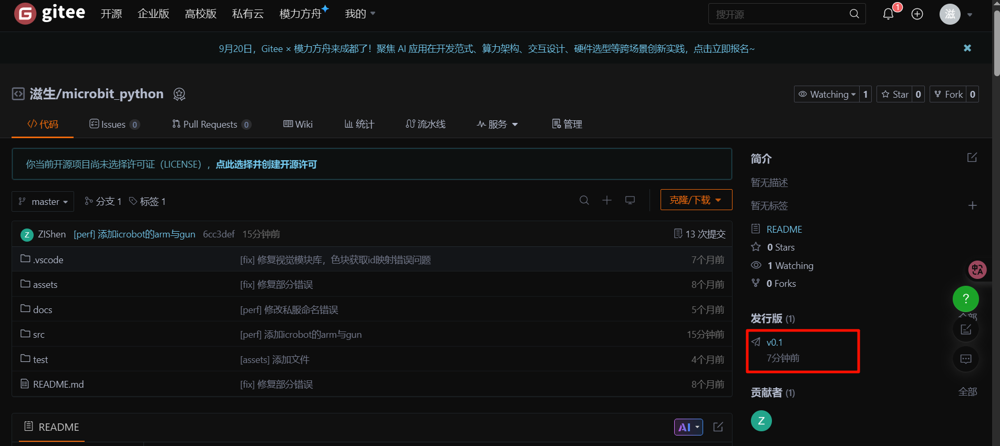
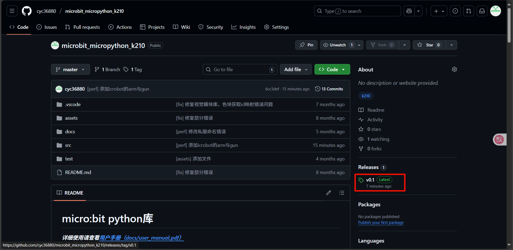

# Extension-Micro_Python

## micro:bit Python User Guide
### Interface Overview
Click the link [micro:bit Python Editor](https://python.microbit.org/v/3/project) to enter the online editor. When entering for the first time, the interface looks like this:


| _**<font style="color:#DF2A3F;">No.</font>**_ | _**<font style="color:#DF2A3F;">Name</font>**_ | _**<font style="color:#DF2A3F;">Function</font>**_ |
| --- | --- | --- |
| ① | Function Panel | Project management |
| ② | Send Code | Send scripts to the connected micro:bit |
| ③ | Code Editor | Edit user code |
| ④ | Save | Save the project as a .hex file to your computer |
| ⑤ | Open | Open a local file |
| ⑥ | Status Display | Show the current status of the micro:bit |


**Language Switching**

**Step 1: Click the gear icon in the lower-left corner and select the Language button.**


**Step 2: In the pop-up window, select your desired language.**

_**<font style="color:#DF2A3F;">  
</font>**_**Note: It is recommended to use micro:bit V2.0 or above. Lower versions have insufficient memory and may not function properly.**

_**<font style="color:#DF2A3F;"></font>**_

### Quick Start
#### Usage Notes:
+ Due to memory limitations, you cannot directly import all library files.
+ Only import the libraries required for your project. Remove unused libraries to optimize memory usage

#### Downloading Files
Visit [GitHub](https://github.com/cyc36880/microbit_micropython_k210.git) to download the Python driver files.

For users in Mainland China, visit [Gitee](https://gitee.com/cyc36880/microbit_python.git).

1. Choose a hosting platform and select the release version (download the latest version if unsure).

| gitee | github |
| --- | --- |
|  |  |


2. Click Download ZIP and wait for the browser to start downloading.

| gitee | github |
| --- | --- |
|  |  |


3. Save the file to your computer.

| gitee | github |
| --- | --- |
|  |  |
| | |


4. Unzip the file and locate the required Python files.


When using the libraries, you should at least import the following files:

`color.py`、`DC_motor.py`、`iic_base.py`

These files form the foundation for other device driver libraries. Without them, the system will not function properly.


#### Importing Files
##### Single File Import
1. Click the Open button (lower-left or lower-right).


2. Select the file you want to import and click Open.


3. Select the file you want to import and click Open.


4. A success message appears at the top, and the file is added to the project list.


##### Multiple File Import
The process is similar to single file import. (See demo GIF for details.)


#### Device Connection
1. Use a microUSB cable to connect the hub and computer.


2. Use a Grove cable to connect the micro:bit with the vision module.


#### Downloading Scripts


Ensure that the micro:bit is connected to your computer. Use the default starter code provided on the website, then click the highlighted button to send the code to the controller.

> On the first download, firmware flashing may take longer. Later downloads will be faster.
>


**Default program effect:**


Display a heart icon.

After 1 second, scroll “Hello”.

Loop continuously.

```python
from microbit import *

import server_motor # 导入库（文件名）

m1 = server_motor.motor(addr = server_motor.LIGHT_RED) # 创建设备对象

while True:
    m1.run(20) # 对象使用
```

These are examples of servo motor usage.

+ Line 1: from microbit import * imports the micro:bit library. Without this library, functions such as sleep cannot be used.
+ Line 3: import server_motor imports the server_motor library.
+ Line 5: Creates a device operation object. All subsequent operations on the corresponding device must be carried out through this object.
+ Line 8: Demonstrates the use of the object.

All device drivers follow a similar usage pattern.


### Examples
#### Six-Way Grayscale Sensor
Follow the library import steps. In addition to the required libraries, import six_gray.py.


Connect the micro:bit to the six-way grayscale module using a Grove cable.


Write the following code in the code editor and write it to micro: bit to see the effect.

```python
from microbit import *

import six_gray # 导入六路灰度库

sg = six_gray.six_gray_sensor() # 创建模块操作对象

while True:
    print(sg.gray()) # 打印六路灰度值
    sleep(500)
```


#### OLED & Python Libraries
Referring to the library import process, in addition to the libraries that must be imported, you also need to import oled.py libraries. The project files are shown in the figure below


```python
from microbit import *

import oled  # 导入OLED库

display = oled.oled()  # 创建模块操作对象

count=0
while True:
    count+=1
    if count>20:
        count=0
    display.set_text(0, 0, "hello %d  " % (count)) # 显示字符串
    sleep(400)

```


_*** For the use of other devices, please refer to the API and try it yourself**_

### micro:bit Python Overview:
The Python library includes multiple device drivers. With Python’s flexibility, you can create more versatile, maintainable, and widely applicable code.


Library Files Overview:

| File | Function |
| :---: | :---: |
| color.py | Color definitions |
| ai_camera.py | AI camera library |
| DC_motor.py | DC motor library |
| iic_base.py | IIC driver library |
| joystick.py | Joystick library |
| light_ring.py | LED ring library |
| oled.py | OLED display library |
| recording.py | Recording module library |
| server_motor.py | Servo motor library |
| servors.py | General servo library |
| six_gray.py | Six-way grayscale library |
| ultrasonic.py | Ultrasonic sensor library |


## API Reference
For detailed API documentation of the visual recognition module in the micro:bit Python editor, please refer to the Block Guide – Vision Recognition.

