## Extension-ICBricks 2.0

## Quick Start
In the ICBricks software, the Vision Module Extension must be used together with the K210 Vision Module.

During use, up to 11 AI functions can be called, including color recognition, color block tracking, tag recognition, and 20-class object recognition.

For more details, please refer to the K210 Vision Module Documentation.

**Example: Use Tag Recognition to Control Motor Start/Stop**

Preparation

| 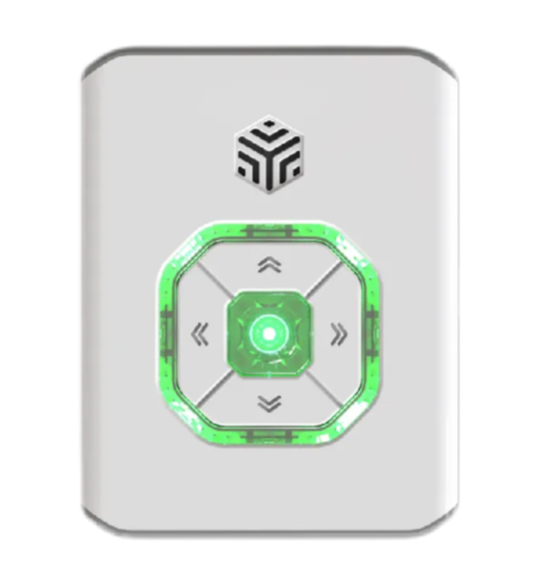 | 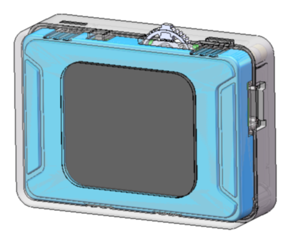 | 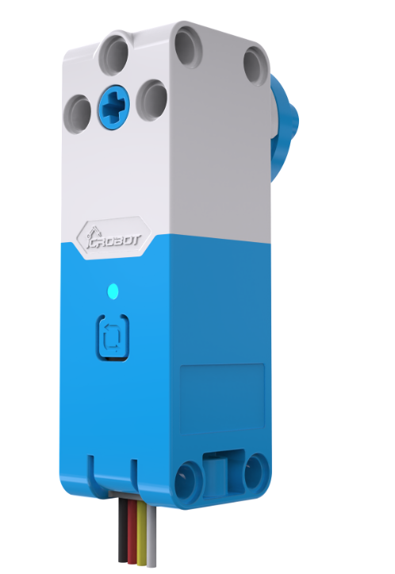 | 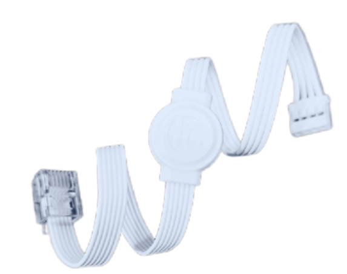 |
| --- | --- | --- | --- |
| ICBricks × 1 | K210 AI Vision Sensor × 1 | Servo Motor × 1 | RJ11 to Grove Cables × 2 |

Operating Steps

| 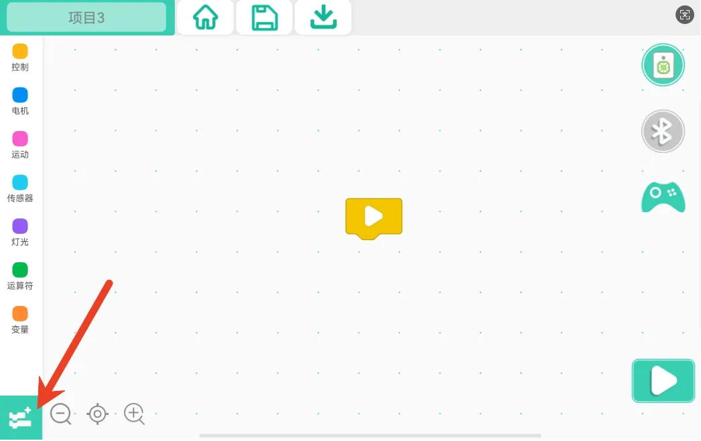 | 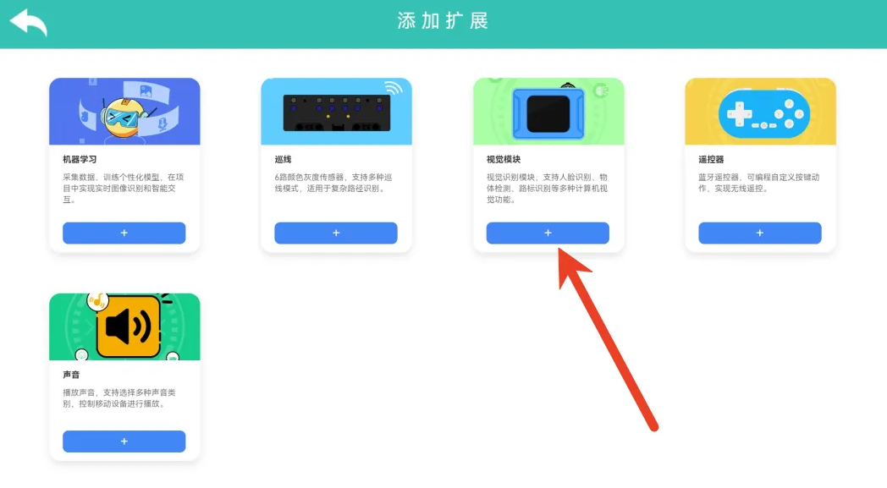 |
| --- | --- |
| Step 1: Click Add Extension. | Step 2: Select Machine Learning. |
| 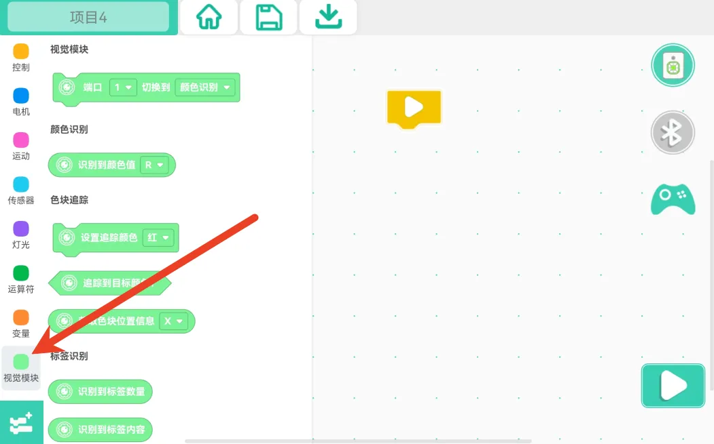 | 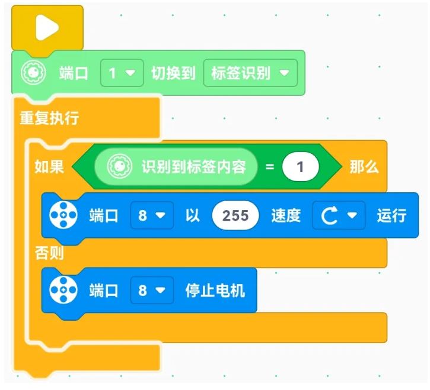 |
| Step 3: Check whether the vision module command blocks have been added. | Step 4: Write the program. |
| 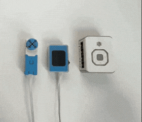 | 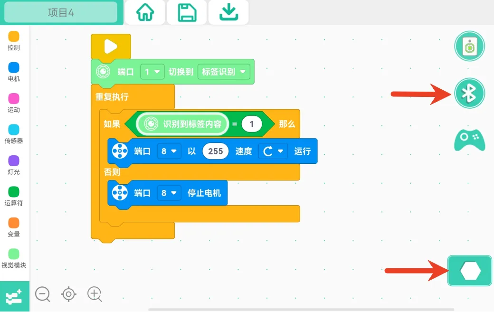 |
| Step 5: Power on the main controller and connect the vision module and actuators to the corresponding ports according to the program. Make sure the vision module I²C address is set to 0x24. | Step 6: Connect the main controller to the programming software via Bluetooth, click the Start Program button, and run the program. |

Demo:

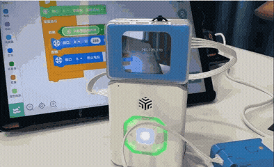

## Related Command Instructions
The vision module command blocks in the ICBricks programming software can be found in the Block Guide – Vision Recognition.

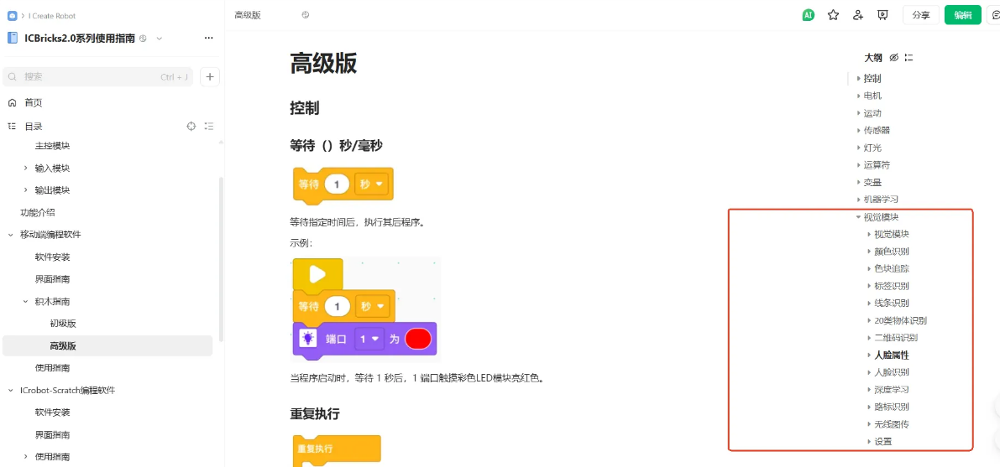

