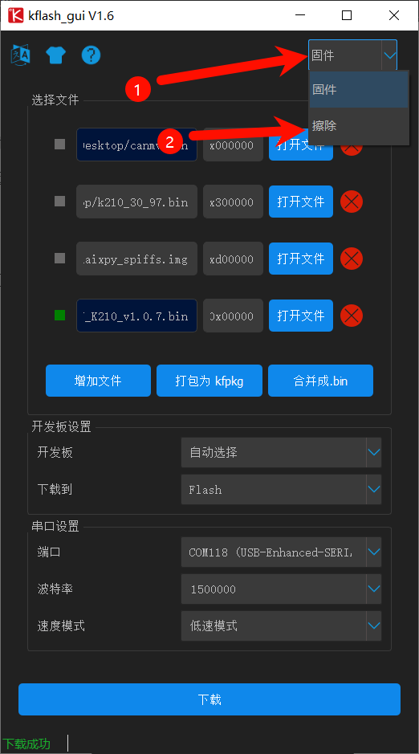
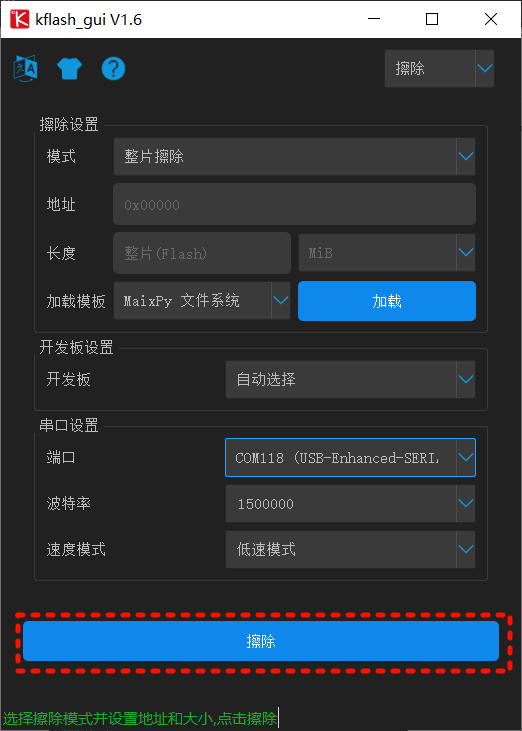
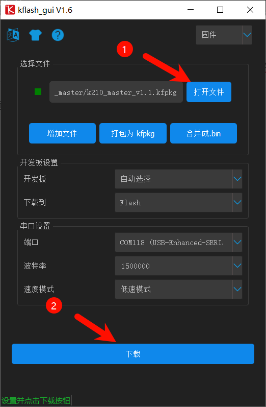
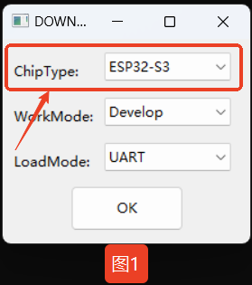
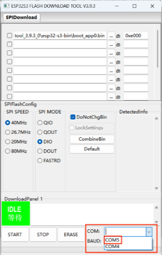
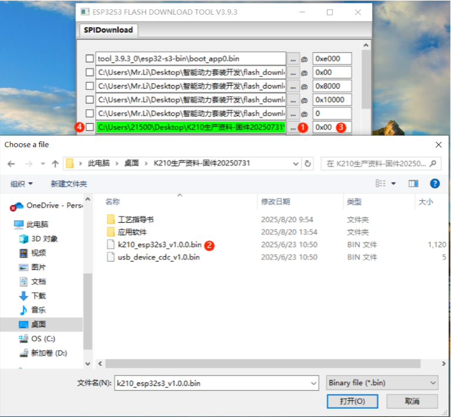
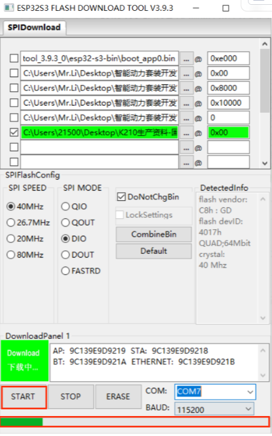
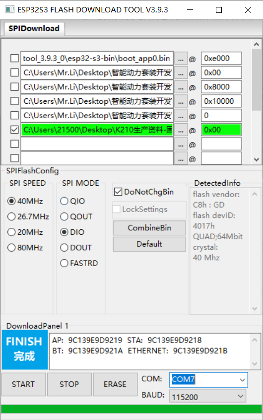
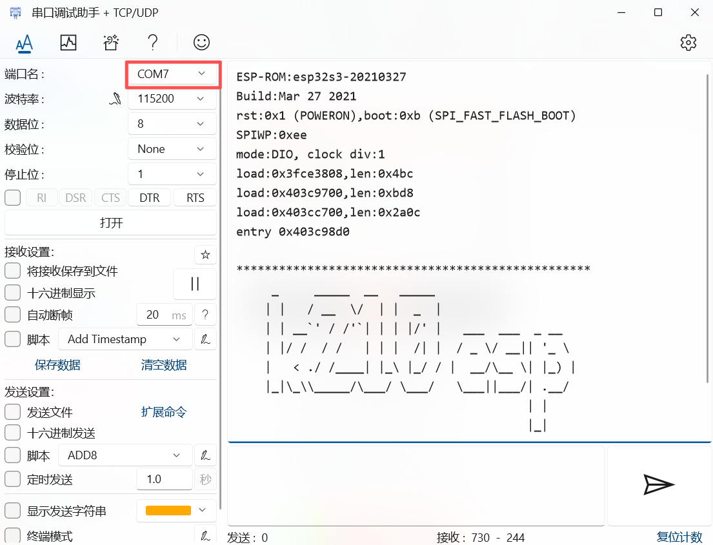

# Firmware Flashing
The Type-C port on the side of the module supports both firmware flashing and power supply.

When the vision module is connected to a computer via a Type-C cable, the computer will recognize two serial ports: 

+ The larger-numbered COM port → corresponds to the onboard ESP32.
+ The smaller-numbered COM port → corresponds to the K210 chip.

**Note: The actual COM port numbers may vary depending on the operating system. It is recommended to check them via the Device Manager or a serial terminal tool.**

**Flash Files:**  
Download the required firmware files from the [official website](https://www.icrobot.com/www/cn/index.html#/file/index?type2=ICreate%20AI%20Vision).

## Flashing the K210
1. Open the flashing tool: Launch kflash_gui and select Erase.

2. In the erase interface, refer to the options shown in the figure. Make sure to select the port according to the actual port number of your device.

3. Click “Open File” and select the firmware. In the dialog box, choose the file k210_master_v1.1.kfpkg. Refer to the figure for the other options, and make sure to select the correct port according to your device. Then click “Burn” and wait until the process is completed.

## ESP32-S3 Firmware Flashing
**The onboard chip is ESP32-S3FN8. You can either program and flash it using Arduino IDE, or use the official Espressif Flash Download Tool.**

1. Configure the program:

Open the flash_download_tool_3.9.3.exe application, select ChipType = ESP32-S3, and click OK.

2. Connect the device:

Use a Type-C data cable to connect the K210 AI Vision Module to your computer. In the lower

3. Upload the firmware:

Click “...”, and in the dialog box select the file k210_esp32s3_v1.0.0.bin. Set the address to 0x00, and check the box in front of the firmware file.

4. Flash the firmware:

Click “START” and wait until the progress bar is completed. A “FINISH” message will indicate that the flashing process has been successfully completed.

5. Verification:

Open a serial debugging tool and select the larger COM port. If the flashing is successful, the module will return output similar to the example shown in the figure.

