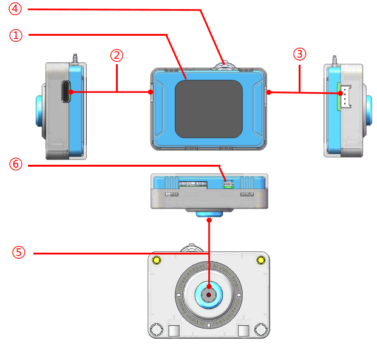
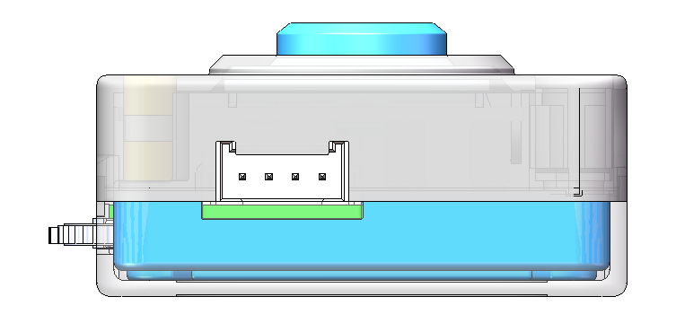
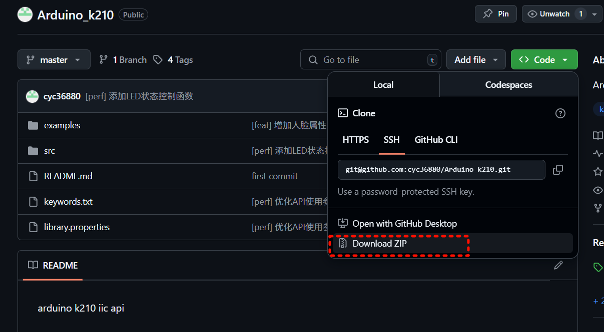

# k210
## Introduction

This module features the **K210** as its AI processing core. Users can switch between multiple built-in AI functions by toggling the rotary knob at the top. On the right side, a **Grove interface** is provided, which can be configured via a graphical user interface to support either I²C or UART communication protocols. It enables connection to various external peripherals and is fully compatible with LEGO SPIKE and EV3 systems, offering excellent compatibility and ease of use. Additionally, the module leverages the **ESP32-S3** to communicate with the K210, enabling stable and efficient Wi-Fi image transmission.

---

## Onboard Core Chips

### ● K210

The Kendryte K210 is a high-performance, low-power RISC-V processor designed for edge computing and AI vision tasks. It integrates dual 64-bit cores, a KPU neural network accelerator, an image signal processor (ISP), and audio processing modules, making it capable of completing image acquisition and AI inference locally. In this product, the K210 handles image processing from the camera and performs tasks such as color recognition, object tracking, QR code recognition, and face detection. It can also emulate the SPIKE color sensor protocol to communicate with external host controllers.

### ● ESP32-S3

The ESP32-S3, developed by Espressif Systems, is a high-performance Wi-Fi + BLE dual-mode SoC featuring a dual-core Xtensa LX7 architecture with a clock speed up to 240 MHz and rich peripheral interfaces. In this module, the ESP32-S3 communicates with the K210 via UART and is specifically responsible for streaming image data over Wi-Fi, enabling wireless image transmission within a local area network.

---

## Module Structure Overview

| No. | Name              | Description                                      |
| :-: | :---------------- | :----------------------------------------------- |
|  ①  | 1.69” LCD Display | Displays the UI and camera feed                  |
|  ②  | Type-C Port       | Used for power supply and firmware updates       |
|  ③  | Grove Interface   | HY2.0-4P port for power and signal transmission  |
|  ④  | Rotary Button     | Toggle left, right, or press to switch functions |
|  ⑤  | Camera            | Captures images for K210 visual processing       |
|  ⑥  | Reset Button      | Reboots the module                               |

---

## Grove Interface Pinout

* **I²C Mode**: `GND`, `VCC`, `SDA`, `SCL` (from left to right)
* **UART Mode**: `GND`, `VCC`, `RX`, `TX` (from left to right)

---

## Communication Overview

The module supports the following communication methods:

* `I²C` (with selectable addresses)
* `UART` (standard serial configuration)
* `SPIKE Emulation Protocol` (compatible with LEGO SPIKE and EV3)

Users can choose the communication mode via the settings interface. After selecting, click “Exit” to reboot the device and apply the new configuration.

---

### I²C Communication

#### Device Addresses

Three selectable I²C addresses are available:

* `0x24`
* `0x25`
* `0x26`

These can be configured through the settings menu. After applying changes, the device will automatically reboot to avoid conflicts on shared I²C buses.

#### Protocol Details

Please refer to the \[`registed`] document for the complete I²C communication protocol specification.

---

### UART Communication

#### Serial Settings

* **Baud Rate**: 115200
* **Data Bits**: 8
* **Parity**: None
* **Stop Bits**: 1
* **Flow Control**: None

Ensure that the host controller or PC uses the same configuration for successful communication.

#### Protocol Details

Please refer to the \[`serial_communication`] document for details on the UART protocol and command format.

---

### SPIKE Compatibility Mode

When the communication protocol is switched to **SPIKE Mode**, the module emulates a SPIKE color sensor. The K210 generates corresponding color, reflection, and RGB values based on the recognition results from each AI mode.

For detailed value mappings, refer to the \[`k210_spike`] document to accurately decode sensor data in different AI modes.

---

## Programming Control

### Arduino

Please visit the [GitHub repository](https://github.com/cyc36880/Arduino_k210/tree/master#), follow the illustrated instructions to download the ZIP archive of the project, and import it into the Arduino development environment. You can then refer to the `examples` folder to learn how to use the provided APIs to control and operate the vision module, enabling rapid implementation of various AI functions.

------

## Feature Overview

------

###  UI Behavior

- If **no interaction** (button press, UART/I²C communication) is detected for more than **5 seconds**, the bottom status bar will automatically be hidden.
- All button operations **only take effect when the status bar is visible**. If the bar is hidden, the first button press will only bring it up without triggering any action.
- In the settings interface, after making changes, the user must click **Exit** to apply them. Some settings require a **device reboot** upon exiting to take effect.

------

### Color Detection

- A rectangular area is shown at the center of the screen.
- The module calculates the **average RGB values** of the pixels within this area.
- The displayed color represents the average color value, ideal for standardized recognition.

------

### Color Blob Tracking

- Press the button to enter color selection mode.
- Toggle left/right to choose from six predefined colors (**Red, Green, Blue, Yellow, Black, White**).
- Selecting the last option allows the user to aim the central box at any color in view, then press the button again to **lock that color for tracking**.

------

### AprilTag Recognition

- Supports recognition of **TAG36H11** and **TAG16H5** AprilTag formats.
- Point the camera at a tag, and the screen will automatically highlight it, displaying its `x`, `y`, `width`, `height`, and ID.

------

### Line Detection

- Detects black lines placed on a white background.
- The screen divides into **top, middle, and bottom zones**, and highlights detected lines within each.
- Recommended to use in scenes with **minimal background noise**.

------

### 20-Class Object Detection

- Supports recognition of the following 20 object categories:

> "Airplane", "Bicycle", "Bird", "Boat", "Bottle", "Bus", "Car", "Cat", "Chair", "Cow", "Dining Table", "Dog", "House", "Motorcycle", "Person", "Potted Plant", "Sheep", "Sofa", "Train", "TV"

- Recognized objects are boxed and labeled on screen.
- Up to **4 objects can be recognized simultaneously**.

------

### QR Code Recognition

- Only supports **black-and-white square QR codes**, one at a time.
- When aimed at a QR code, the screen highlights it and shows the decoded content.

------

### Facial Attribute Recognition

- Detects three facial attributes: **mouth open/closed**, **smile/no smile**, and **glasses/no glasses**.
- Supports **up to 4 faces** simultaneously, with attributes displayed for each.

------

### Facial Recognition (with Learning)

- Faces not previously trained will be outlined in white.
- Once a face is outlined, press the button to **learn** it and assign an **ID (0–3)**.
- Supports **persistent memory**, IDs remain valid after power cycles.
- Maximum of **4 faces** can be stored.
- **Long-press** the button to prompt a reset confirmation dialog; confirming clears all learned faces.

------

### Deep Learning (Custom Training)

- Supports training of **up to 2 custom categories**, with **3 images per class**.
- Press the button to begin training; the **top-left corner** shows the class index, and the **top-right** shows number of captured samples.
- If no input is detected within 5 seconds after finishing the first class, the device will **automatically switch to recognition**.
- Upon reaching the max number of classes, pressing the button or waiting 5 seconds will **enter recognition mode**.
- During recognition, **mode switching is disabled**. **Long-press the button** to reset training data and exit.

------

### Road Sign Recognition

- Supports 6 road sign types:

> Green Light, Turn Left, Stop, Red Light, Turn Right, Horn, Target

- When the camera is aimed at a road sign, it will be highlighted and labeled on the screen.

------

###  Wi-Fi Streaming

- Requires a **2.4GHz Wi-Fi network** and a corresponding QR code for connection.
- Upon successful connection, the screen will show the `SSID`, `Password`, and `IP Address`.
- Any device connected to the same LAN can **access the video stream via browser** using the shown IP.
- During streaming, the screen will **automatically turn off** for power saving. **Any button interaction wakes the screen**.
- Disconnecting Wi-Fi or selecting **Exit** will **terminate streaming** and reactivate the display.

------

## Feature Overview

------

### UI Behavior

- If **no interaction** (button press, UART/I²C communication) is detected for more than **5 seconds**, the bottom status bar will automatically be hidden.
- All button operations **only take effect when the status bar is visible**. If the bar is hidden, the first button press will only bring it up without triggering any action.
- In the settings interface, after making changes, the user must click **Exit** to apply them. Some settings require a **device reboot** upon exiting to take effect.

------

### Color Detection

- A rectangular area is shown at the center of the screen.
- The module calculates the **average RGB values** of the pixels within this area.
- The displayed color represents the average color value, ideal for standardized recognition.

------

### Color Blob Tracking

- Press the button to enter color selection mode.
- Toggle left/right to choose from six predefined colors (**Red, Green, Blue, Yellow, Black, White**).
- Selecting the last option allows the user to aim the central box at any color in view, then press the button again to **lock that color for tracking**.

------

### AprilTag Recognition

- Supports recognition of **TAG36H11** and **TAG16H5** AprilTag formats.
- Point the camera at a tag, and the screen will automatically highlight it, displaying its `x`, `y`, `width`, `height`, and ID.

------

### Line Detection

- Detects black lines placed on a white background.
- The screen divides into **top, middle, and bottom zones**, and highlights detected lines within each.
- Recommended to use in scenes with **minimal background noise**.

------

### 20-Class Object Detection

- Supports recognition of the following 20 object categories:

> "Airplane", "Bicycle", "Bird", "Boat", "Bottle", "Bus", "Car", "Cat", "Chair", "Cow", "Dining Table", "Dog", "House", "Motorcycle", "Person", "Potted Plant", "Sheep", "Sofa", "Train", "TV"

- Recognized objects are boxed and labeled on screen.
- Up to **4 objects can be recognized simultaneously**.

------

### QR Code Recognition

- Only supports **black-and-white square QR codes**, one at a time.
- When aimed at a QR code, the screen highlights it and shows the decoded content.

------

### Facial Attribute Recognition

- Detects three facial attributes: **mouth open/closed**, **smile/no smile**, and **glasses/no glasses**.
- Supports **up to 4 faces** simultaneously, with attributes displayed for each.

------

### Facial Recognition (with Learning)

- Faces not previously trained will be outlined in white.
- Once a face is outlined, press the button to **learn** it and assign an **ID (0–3)**.
- Supports **persistent memory**, IDs remain valid after power cycles.
- Maximum of **4 faces** can be stored.
- **Long-press** the button to prompt a reset confirmation dialog; confirming clears all learned faces.

------

### Deep Learning (Custom Training)

- Supports training of **up to 2 custom categories**, with **3 images per class**.
- Press the button to begin training; the **top-left corner** shows the class index, and the **top-right** shows number of captured samples.
- If no input is detected within 5 seconds after finishing the first class, the device will **automatically switch to recognition**.
- Upon reaching the max number of classes, pressing the button or waiting 5 seconds will **enter recognition mode**.
- During recognition, **mode switching is disabled**. **Long-press the button** to reset training data and exit.

------

### Road Sign Recognition

- Supports 6 road sign types:

> Green Light, Turn Left, Stop, Red Light, Turn Right, Horn, Target

- When the camera is aimed at a road sign, it will be highlighted and labeled on the screen.

------

### Wi-Fi Streaming

- Requires a **2.4GHz Wi-Fi network** and a corresponding QR code for connection.
- Upon successful connection, the screen will show the `SSID`, `Password`, and `IP Address`.
- Any device connected to the same LAN can **access the video stream via browser** using the shown IP.
- During streaming, the screen will **automatically turn off** for power saving. **Any button interaction wakes the screen**.
- Disconnecting Wi-Fi or selecting **Exit** will **terminate streaming** and reactivate the display.
